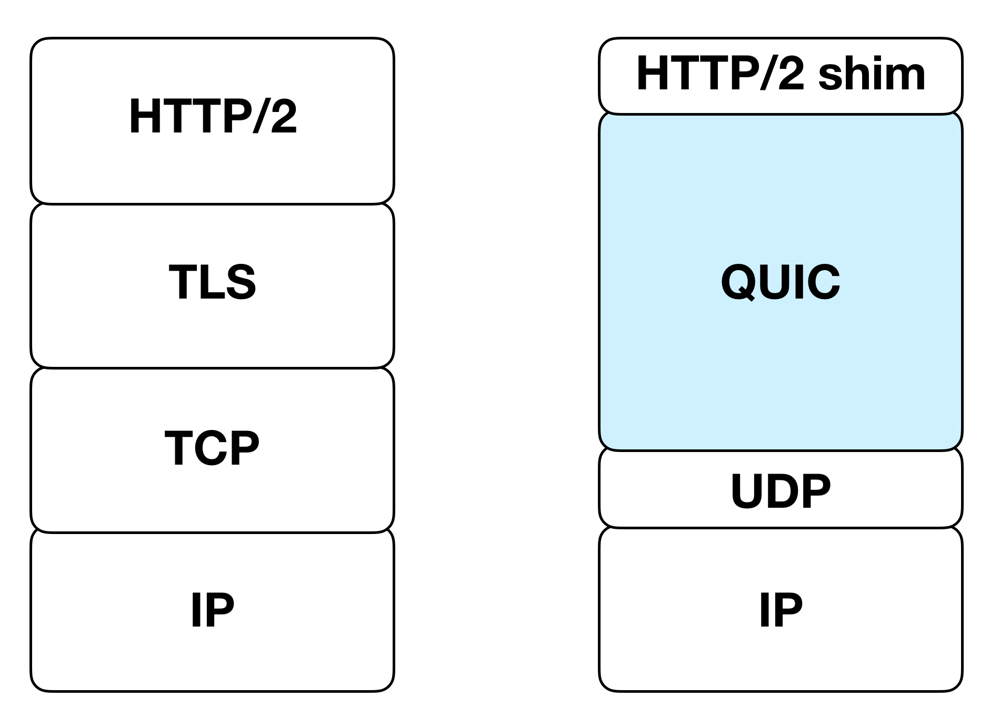
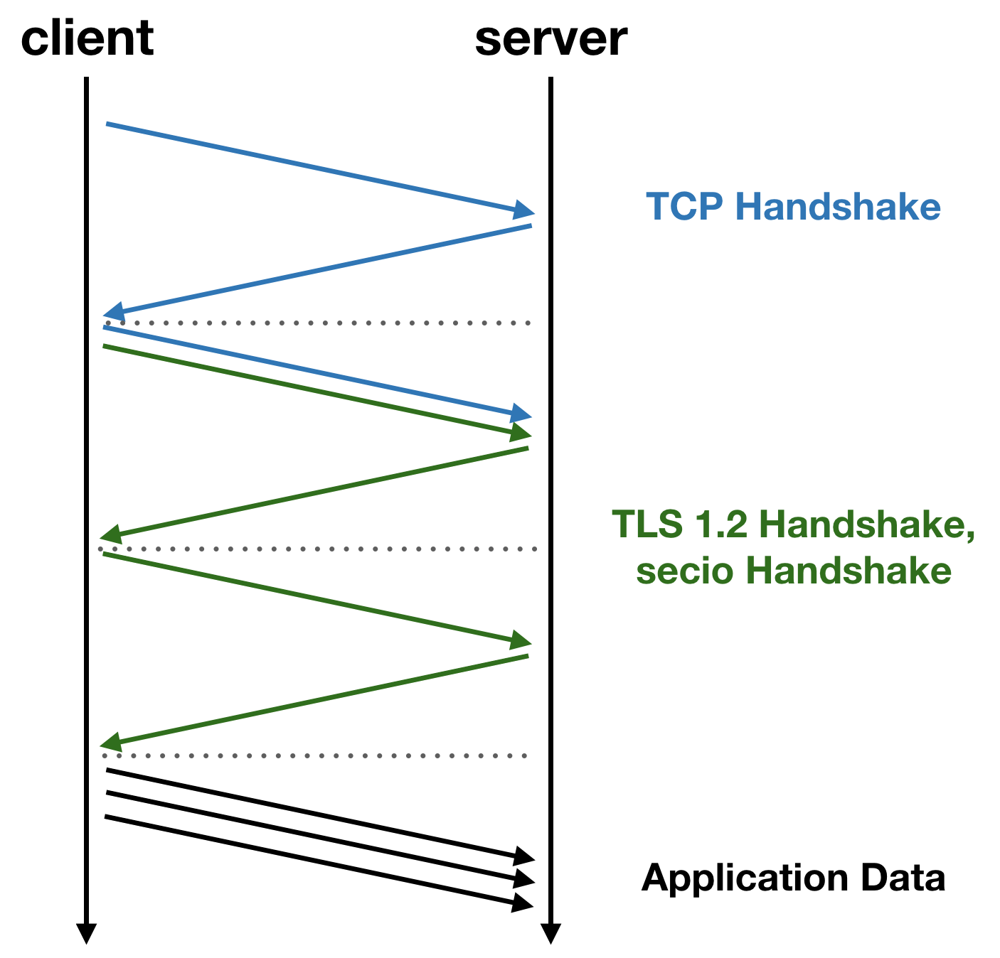
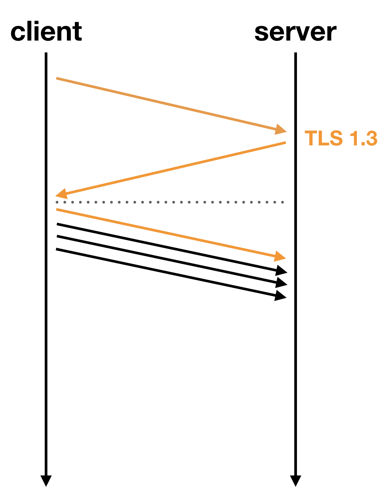
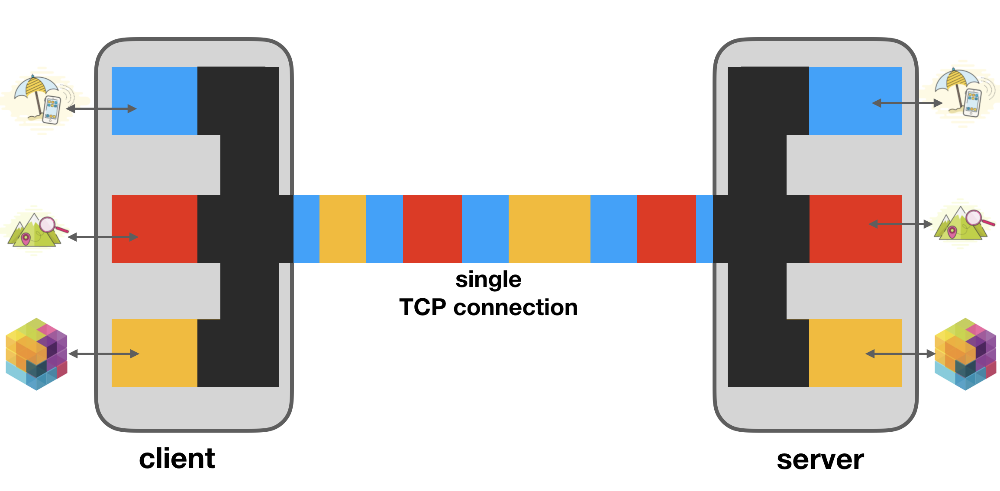

# QUIC

QUIC is a new UDP based internet transport that was invented by Google in 2013 and rolled out as an experiment in Google Chrome and Google's frontend servers over the next few years. According to Google's [measurements](https://www.ietf.org/proceedings/99/slides/slides-99-maprg-the-quic-transport-protocol-design-and-internet-scale-deployment-00.pdf), on lossy connections QUIC reduces search latency (the time it takes to fully load the Google Search page) by 3.6 to 8% and the YouTube rebuffer rate (the number of times a YouTube video stops to load new data) by 15 to 18%.

In 2016, the IETF formed a Working Group to specify the QUIC protocol, which is scheduled to complete the protocol specification by mid 2019.



QUIC replaces a big part of the current protocol stack of the web:

- it runs on top of UDP, so it has to take care of loss recovery
- it runs a cryptographic handshake and takes care of encrypting the connection
- it provides streams at the transport level

In this blog post, I will show how QUIC solves multiple problems inherent to the traditional network stack.

## Handshake Latency



In order to establish a new encrypted connection between two hosts (the same applies to TLS 1.2 connection), the client first initiates a TCP connection. The three-way handshake necessary to establish a TCP connection takes one network roundtrip time. After that, the client initiates the cryptographic handshake (secio for libp2p connections, or TLS for browsers). Establishing a secio or TLS 1.2 connection takes another two roundtrip times. Once that is done, client and server are set up to exchange application data.



By using QUIC we can reduce the handshake latency down to a single roundtrip. Since QUIC runs on top of UDP, we don't need the three-way handshake. By using TLS 1.3 instead of secio or TLS 1.2, we save another roundtrip. With TLS 1.3, it's even possible to eliminate handshake latency altogether by doing a so called 0-RTT handshake. The only requirement for this is that the peers already established a connection before, and exchanged some key material.

## Stream Multiplexing



libp2p uses streams to transmit data between peers. Streams are a concept that was introduced in Chrome and the Google's frontend servers with the SPDY protocol (which later became HTTP/2). A stream is a birection flow of bytes within an established connection. The advantage of using streams instead of separate connections is that we only need to establish a single TCP connection, and then multiplex a large number of streams on that connection. Opening new streams therefore becomes very cheap. In libp2p, we're using different stream multiplexers, such as [yamux](https://github.com/hashicorp/yamux) and [mplex](https://github.com/libp2p/specs/tree/master/mplex), that are conceptionally very similar to SPDY.

However, there's a hidden cost associated with multiplexing streams on a single connection. Since the kernel makes sure that a TCP connection is an ordered byte-stream, if a packet is lost, it will have to wait for the retransmission of that packet to arrive. All subsequently received packets have to wait for this retransmission to arrive before they can be read. Since the kernel doesn't have any knowledge how the applicaiton is using the TCP connection, this even applies if the packet which was lost only contains data belonging to stream X, and later packets contain data belonging to stream Y and Z were already received. This is called "head-of-line blocking".

QUIC resolves this kind head-of-line blocking by moving streams from the application layer down to the transport layer. By using UDP, which doesn't provide any ordering guarantee, packets can be processed in whichever order they arrive. When a QUIC packet is lost, only the streams that data was contained in that packet for are affected, but all other streams can make progress as if nothing happened.

## Connection Migration

When a mobile device switches between WiFi and mobile data networks, existing TCP connections time out and the device has to reinitiate a new connection. This is caused by the way the kernel handles TCP connections: When receiving a packet, it looks at the 4-tuple (source and destination IP address and port) in order to associate it with an existing connection. This model worked well in the early days of the internet, when computer were stationary and IP addresses were stable. 

For mobile devices switching between WiFi networks and mobile networks, this leads to interruptions every time the network changes. QUIC solves this problem by not relying on the 4-tuple. Connections are identified by so called connection IDs instead, which is contained in the header of every QUIC packet. To prevent linkability between the old and the migrated connections, peers will switch to a new connection ID they agreed upon before when switching between network interfaces.

## Advanced Loss Recovery and Congestion Control

Since QUIC uses UDP, it has to deal with recovering from a packet loss. QUIC's loss recovery algorithms build on decades of experience with TCP's loss recovery, and fixes some of TCP's problem.

One source of uncertainty in TCP stems from the way packets are retransmitted. When TCP detects that a packet was (potentially) lost, it retransmits the packet as a whole, using the same sequence number. When receiving an acknowledgement for that sequence number, the sender can't be sure if this acknowledgement was generated when receiving the retransmission, or if the original packet was delayed.

QUIC therefore never retransmits packets. When QUIC detects a packet as lost, it takes all the frames from that packet that need to be retransmitted, and sends a new packet as a retransmission. This retransmission gets a new packet number, so there will never be an ambiguity when receiving acknowledgements.

## Encryption

There's no such thing as an unencrypted QUIC connection. QUIC uses TLS 1.3 to establish key material to encrypt the connection. QUIC doesn't only encrypt all the application data exchanged over a QUIC connection, but also all internal information exchanged (e.g. acknowledgements for received packets, flow control updates, etc.). For an external observer, there's very little that can be learnt by looking at a QUIC flow: Except for the first packet containing the ClientHello TLS message (which necessarily can't be encrypted, since there's no shared key material between the endpoints yet), only the connection ID is unencrypted. Even the packet number is covered by QUIC's encryption.

Apart from the obvious privacy benefit this provides, it will also ensure that future changes to the QUIC protocol will be possible. It's a sad fact today that a lot middleboxes inspect TCP data flows, and sometimes even rewrite options in the TCP header. Deploying a new TCP extension is therefore not an easy task: Things break in unpredictable ways when middleboxes don't understand the new extension, but still modify the TCP header. By encrypting everything, middleboxes won't even be able to read protocol internals.

## QUIC Versions

QUIC is now being standardized by the IETF. Although a lot of people put a lot of thought into designing QUIC as the best protocol possible, only time will tell how well those design decisions will work in practice. It's essential that the QUIC protocol remains flexible, so that issues can be fixed and new features can be added.

QUIC therefore has built-in version negotiation. When two endpoints establish a new QUIC connection, they negotiate a QUIC version that is supported by both of them. The QUIC version number space is huge, 32 bits, to give implementors of the protocol a lot of room for defining and deploying experimental QUIC versions with new features, which might then later become part of the next IETF standard for a future QUIC version.

## How to activate QUIC in IPFS

Since [version 0.4.18](https://ipfs.io/blog/53-go-ipfs-0-4-18/) IPFS has experimental support for IETF QUIC (roughly at [draft 12](https://tools.ietf.org/html/draft-ietf-quic-transport-12)).

There are two steps necessary to activate QUIC. First, enable the QUIC experiment by running

```bash
ipfs config --json Experimental.QUIC true
```

Then edit the `~/.ipfs/config` to add a QUIC swarm addresses (e.g. `/ip4/0.0.0.0/udp/4001/quic`, if you want QUIC to listen on UDP port 4001).


