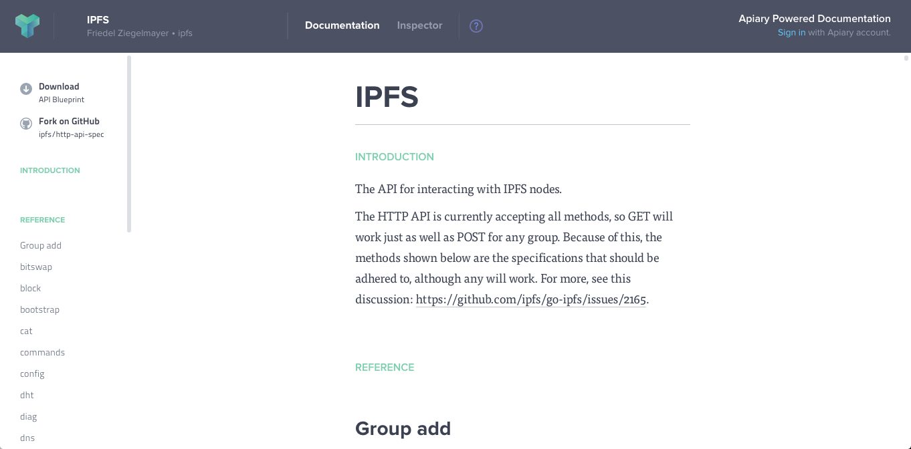

---
# this is the final blog post's id (used in the directory)
# this id is part of the url, and should only contain:
#   letters, numbers, dashes.
id: http-api-spec-on-apiary

breadcrumbs:
  - {name: "http-api-spec-on-apiary", link: "./" }

# the date here should be set to the final publication date,
# on the day it is published.
date: 2015-05-05

# this is the Title
title: The IPFS HTTP API Spec

# this is the name of the main author(s)
author: Richard Littauer

# technical details required for the software, don't change these.
baseurl: ..
template: tmpl/layouts/post.html
collection: posts
---

# Apiary



We now have an HTTP API specification, available on the API-viewing website [Apiary](http://docs.ipfs.apiary.io/#). This means that you can browse through any potential HTTP response for any IPFS command, online.

### What is Apiary?

[Apiary](https://apiary.io) is an online service that provides a nice user interface for looking at HTTP API specifications. It uses the [API Blueprint](https://apiblueprint.org/), a simple and accessible language with concise and expressive syntax. The IPFS description on the Apiary site is generated from the [apiary.apib](https://github.com/ipfs/http-api-spec/blob/master/apiary.apib) file in the [ifps/http-api-spec](https://github.com/ipfs/http-api-spec) repository.

Currently, the Apiary spec has a request and response listed for every command and subcommand that [go-ipfs](https://github.com/ipfs/go-ipfs) sensibly exposes to the API. The spec also includes as many sensible invalid requests (with an invalid number of arguments, the wrong types or arguments, and with inadequate options specified) as needed in order to understand what errors are returned. Finally, it includes a response for most options.

Some commands available on the CLI are not included: for instance, `ipfs init`, `ipfs daemon`, and `ipfs mount` cannot sensibly be called using the HTTP API currently. Many options are also not available; for instance, `verbose` generally prints to standard out, but doesn't change the response. However, there are still 29 different groups (corresponding to CLI commands: `add`, `ls`, `cat`, and so on), comprising over 12500 lines of Apiary blueprint. The coverage is extensive.

### Example entry

The `.apib` syntax is powerful. Here is a simple example of the `ipfs version` command (with some comments):

    # Group version

    <!-- From the `ipfs version --help` usage section -->
    Show version details about the IPFS node.

    ## version [GET /version]
    <!-- From the `ipfs version --help` description section -->
    Returns the current version of ipfs and exits.

    + Request

        <!-- Included to make browsing on Apiary easier -->
        #### curl

            curl -i "http://localhost:5001/api/v0/version"

        + Body

            ```
            curl -i "http://localhost:5001/api/v0/version"
            ```

    + Response 200

        + Headers

            ```
            Access-Control-Allow-Headers: X-Stream-Output, X-Chunked-Output, X-Content-Length
            Access-Control-Expose-Headers: X-Stream-Output, X-Chunked-Output, X-Content-Length
            Content-Type: application/json
            Server: go-ipfs/0.4.3-dev
            Trailer: X-Stream-Error
            Vary: Origin
            Date: Thu, 01 Sep 2016 00:17:20 GMT
            Transfer-Encoding: chunked
            ```

        + Attributes (object)
            - Commit: "d742fb1" (string)
            - Golang: "go1.5.2" (string)
            - Repo:  "3" (string)
            - System: "amd64/darwin" (string)
            - Version: "0.4.3-dev" (string)

        + Body

            ```
            {
              "Commit": "d742fb1",
              "Golang": "go1.5.2",
              "Repo": "4",
              "System": "amd64/darwin",
              "Version": "0.4.3-dev"
            }
            ```

Here, we see a description of the command name and the request type (in this case, `GET`). For the request, we have both a `Body` section (parsed by Apiary, and used in their live mock runner) and a section in the description with the `curl` request, which is used to display the command more clearly on the Apiary site. Then, we have the response; with all of the headers returned from running the `curl` request, as well as an example of the JSON returned and a specification for how the response should looks.

Note that we do not have the parameters for `number`, `commit`, or `repo` (or any of there aliases), all options available using the go-ipfs CLI. This is because these are options which only influence `stdout`, and aren't captured or available in the HTTP API.

### Different Data Structures

The API blueprint language allows us to define our own data structures, of which four in particular are used often by IPFS: ndjson, multihashes, swarm addresses, and multiaddresses.

#### ndsjon

[Newline delimited JSON](http://ndjson.org/) is a new format for transporting JSON text in a stream protocol. This is useful because it allows us to use JSON responses through transports like TCP or Unix Pipes. It also allows us to transport JSON fluidly through [libp2p](https://github.com/libp2p/libp2p), a "network stack" used and developed by the IPFS community which cleanly separates concerns, and enables sophisticated applications to only use the protocols they absolutely need, without giving up interoperability and upgradeability. Many commands return ndjson: here is how we define it in Apiary.

```apib
## ndjson (object)

Newline delimited JSON

### Sample

+ Body

      {
        "Name": "test/test",
        "Bytes": 12
      }
      {
        "Name": "test/test",
        "Hash": "QmePw8gVcBMb8x6kAep6aMBAX23hCSk6iZW3i9VKkiFhu1"
      }
      {
        "Name": "test",
        "Hash": "QmV7sQezAjKh9pokjUPLL7ebuMF5t56UmfhK4cJncCcrNZ"
      }
```

#### Multihash

Multihashes comes from [multihash](https://github.com/multiformats/multihash), one of the [multiformats](https://github.com/multiformats/multiformats). The multiformats are a suite of protocols that are self-describable, which allows better interop, protocol agility, and helps us avoid lock in to a particular format in the future. Multihash, as one of these, is a protocol for differentiating outputs from various well-established cryptographic hash functions, addressing size and encoding considerations.

It is useful to write applications that future-proof their use of hashes, and allow multiple hash functions to coexist. Take a look at [this GitHub thread](https://github.com/jbenet/random-ideas/issues/1) for a longer discussion on this.

```apib
## Multihash (string)
An hash as defined [here](https://github.com/multiformats/multihash).

### Sample

+ Body

      QmNjRVohhWBX31EoaAXkrj5mPF9vQNcTVvQgWHNwdxweCN
```

#### Swarm Addresses

TODO: Fill this out. 

```apib
## SwarmAddrs (object)
A list of swarm addresses.

### Sample

+ Body

      "QmNRCEwFMgCcbjNk5bFud9oqjJduvjBNbkiM8SuxuLh3GS": [
        "/ip4/127.0.0.1/tcp/4001",
        "/ip4/172.17.42.1/tcp/4001",
        "/ip4/192.168.2.3/tcp/4001",
        "/ip6/::1/tcp/4001"
      ],
      "QmNRV7kyUxYaQ4KQxFXPYm8EfuzJbtGn1wSFenjXL6LD8y": [
        "/ip4/127.0.0.1/tcp/4001",
        "/ip4/172.17.42.1/tcp/4001",
        "/ip4/5.9.33.222/tcp/4001",
        "/ip6/2a01:4f8:161:124a::1337:cafe/tcp/4001",
        "/ip6/2a01:4f8:161:124a::2/tcp/4001",
        "/ip6/::1/tcp/4001",
        "/ip6/fcfc:762a:e12a:245d:8e5b:6a40:f65:acab/tcp/4001"
      ]
```

#### Multiaddr

Like multihashes, [multiaddr](https://github.com/multiformats/multiaddr) is one of the multiformats. It provides a standard way to represent addresses that:
- support any standard network protocols
- self-describe (that is, include the protocols they conform to in the address in some way)
- have a binary packed format
- have a nice string representation
- encapsulate well

```apib
## MultiAddr (string)
A multiaddr as defined [here](https://github.com/multiformats/multiaddr).

### Sample

+ Body

      /ip6/fcfc:762a:e12a:245d:8e5b:6a40:f65:acab/tcp/4001
```

### How to edit and join in

This specification can be used immediately to verify that a request you have received from the API is valid. It can also be used as a confirmation standard for cross-language interoperability for IPFS implementations. The [JavaScript IPFS implementation](https://github.com/ipfs/js-ipfs) is already using as a baseline against which to test their outputs, to ensure interop with go-ipfs.

No documentation effort is ever complete, or perfect. If you see an error or would like to add a feature, go to [ipfs/http-api-spec](https://github.com/ipfs/http-api-spec) and join in the conversation in the issues. Current goals that need work include:

 - Making [a test runner](https://github.com/ipfs/http-api-spec/issues/103) that enables Apiary to mock curl requests against a daemon, so that we can do live API tests;
 - [Automatic generation of the API Spec](https://github.com/ipfs/http-api-spec/issues/108) - so far, it has all been written by hand by [@RichardLitt](https://github.com/RichardLitt);
 - [Sharness testing](https://github.com/ipfs/http-api-spec/issues/23) to enable implementations to do live testing against the API;
 - [Enabling subset permissions](https://github.com/ipfs/http-api-spec/issues/2).

For now, [go take a look](http://docs.ipfs.apiary.io/#) and use it! Feedback is always appreciated.
