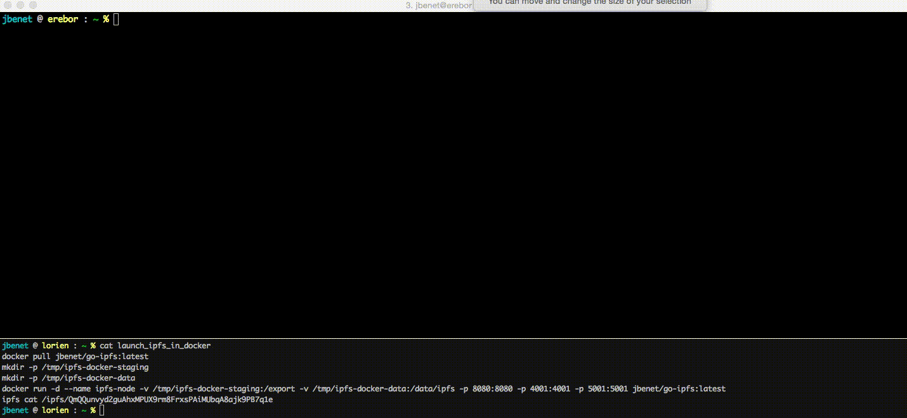

In recent years, Docker and a few other projects have redefined how we run server applications. In the future, containerized applications could even improve how we run apps in our personal devices. At its core, this fast-paced improvement is a combination of good interfaces to standardize how to do things, and great tooling to make using containers easy.

The IPFS Project has many things planned for the world of containers. The most interesting is using IPFS to distribute containers hyper efficiently across data-centers and the internet. We will be discussing many of these things in upcoming posts, but first things first. This post is a quick guide for running an IPFS node directly within Docker.

The IPFS team has provided an [IPFS Docker image](https://registry.hub.docker.com/u/jbenet/go-ipfs/), which is syncronized with the latest commits to [go-ipfs](https://github.com/ipfs/go-ipfs). It only takes a few commands to try it out!

```sh
mkdir /tmp/ipfs-docker-staging
mkdir /tmp/ipfs-docker-data
docker run -d --name ipfs-node -v /tmp/ipfs-docker-staging:/export -v /tmp/ipfs-docker-data:/data/ipfs -p 8080:8080 -p 4001:4001 -p 5001:5001 jbenet/go-ipfs:latest
```

8080 is the HTTP Gateway, which allows you to query ipfs data with your browser ([example](http://gateway.ipfs.io/ipfs/QmVyS3iAy7mvDA2HqQWm2aqZDcGDH3bCRLFkEutfBWNBqN/)), 4001 is what swarm port IPFS uses to communicate with other nodes, and port 5001 is used for the local API.

We've mounted a data and staging volume. The `data` volume is used to store the IPFS config and the database, and `staging` is a directory you can use for staging files for command line usage (such as `ipfs add`). If you're only using the API, you can omit the staging directory volume. And of course, feel free to put those directories somewhere other than `/tmp`.

[Kubernetes 1.0](http://kuberneteslaunch.com) comes out next week, so after that, we'll try using it to build a cluster of IPFS nodes that can store any kind of data and be able to retreive it from any other IPFS node. Not just with IPFS nodes in your cluster, but with everyone!


