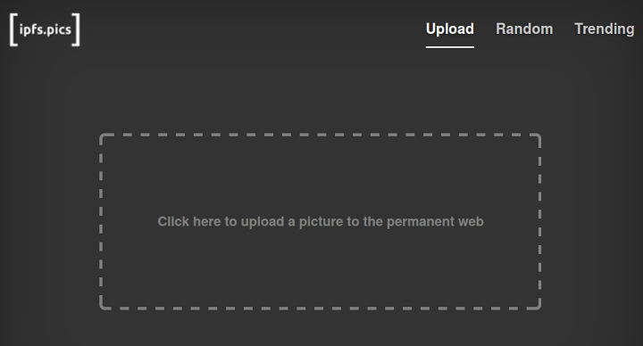

There are [a lot](https://en.wikipedia.org/wiki/List_of_photo-sharing_websites) of photo sharing websites out there, helping people share images with others on the web. But these sites all have a major problem: They depend on a centralized backend to store data. That makes the availability of your images vunerable to budget issues, hacking, server failures, DDoS attacks, acqui-hires, and countless other issues that come from centralization of data.

But what if we could make a decentralized, community-powered image service, that allows the community to help host and propogate images? It turns out someone did exactly that.

Enter **[IPFS.pics](https://ipfs.pics)**, the first decentralized photo sharing service. Backed by [IPFS](https://ipfs.io) nodes, this powerful service allows a fast, convenient way to upload images to the cloud, but in a way that allows anyone to help host and propogate those images.

Images on [IPFS.pics](https://ipfs.pics) don't have to be loaded from their server. You can ask any IPFS node on the network for the image, and it can load it for you from multiple IPFS nodes that have the image via its P2P network. As a demonstration, you can see this image of the IPFS logo via:

* The ipfs.pics image page: https://ipfs.pics/QmfBXNua29mfQvANvpWgsCRuGQNZ4SD2gPNK13u4VA5cx3
* The ipfs.pics gateway: https://ipfs.pics/ipfs/QmfBXNua29mfQvANvpWgsCRuGQNZ4SD2gPNK13u4VA5cx3
* The ipfs.io global gateway: https://ipfs.io/ipfs/QmfBXNua29mfQvANvpWgsCRuGQNZ4SD2gPNK13u4VA5cx3
* And if you have IPFS running on your local computer and connected to the network, your own IPFS gateway server: http://localhost:8080/ipfs/QmfBXNua29mfQvANvpWgsCRuGQNZ4SD2gPNK13u4VA5cx3

IPFS uses content addressing instead of location addressing, sp it doesn't matter what IPFS node has the image. As long as at least one node anywhere on the IPFS network has the content, you can find it with the hash and quickly download it.

### Pinning images to your own IPFS server

If you'd like to help propogate an image, you can do that easily using the `ipfs pin add` command:

    $ ipfs pin add QmfBXNua29mfQvANvpWgsCRuGQNZ4SD2gPNK13u4VA5cx3

This is a great example of the potential power of the Permanent Web. As IPFS continues to grow and add more features, expect many more great hybrid decentralized/centralized site ideas like this in the future. If you'd like to see how [IPFS.pics](https://ipfs.pics) was implemented, check out the [source code](https://github.com/ipfspics/server)!
