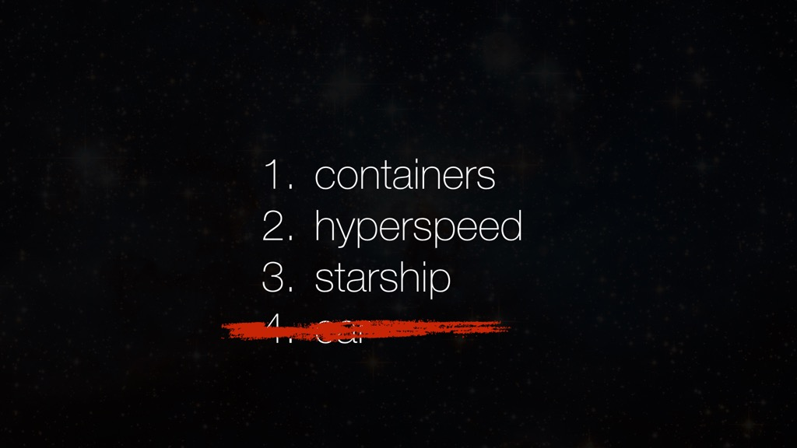
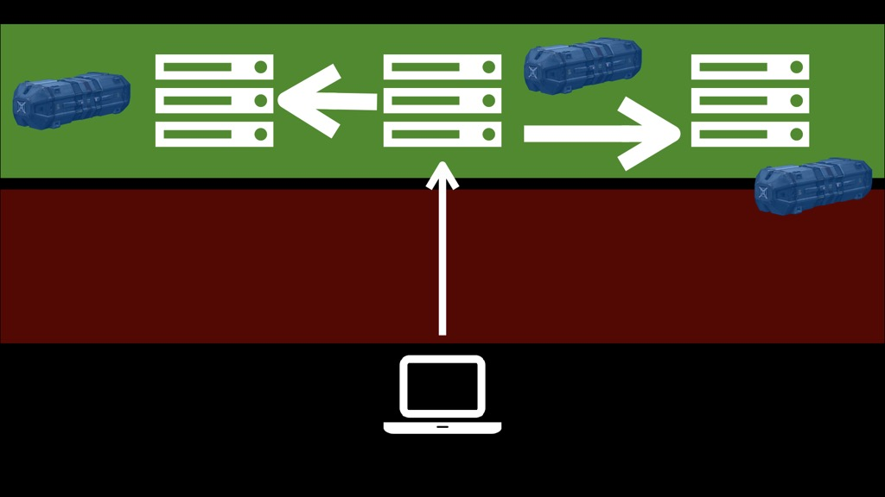
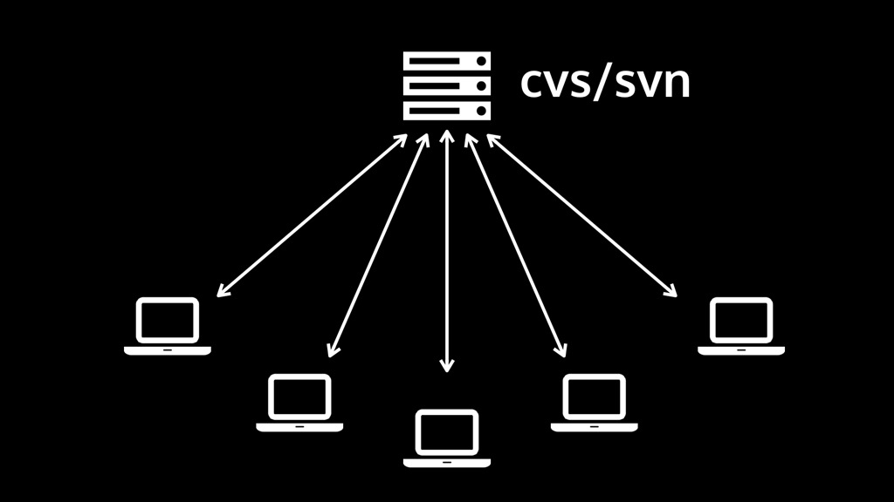
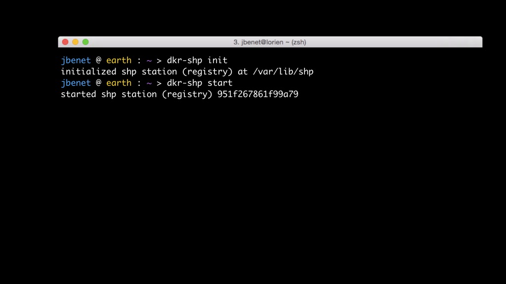

<iframe width="560" height="315" src="https://www.youtube.com/embed/vaIWRyotz4g" frameborder="0" allowfullscreen></iframe>

This talk was given at [container.camp](https://container.camp/ldn-2015/), on September 11th, 2015, in London. Container Camp is the community conference about software containers. Below, we provide a transcription of the video, along with slides.

Alright, thank you. Today, I'm going to talk to you about Containers at Hyperspeed. As was mentioned, I founded Protocol Labs, and what we do at Protocol Lab is think about the Internet; this beautiful machine that we have built.

And we think about how to make it better and we try to think completely out of the box, or out of the wires, and we try to look at the network stack that can say what is missing or what's broken and how can we improve it.

It is like this. I describe it as: you take the network stack.

And then you add some Tesla and some Tesla coils.

And you try to come up with what might make the world better. You try to make everything well-layered, so that everything can play nice.

Often times, you end up going down the rabbit hole of formats and so on, and it is a necessary part of the process.

I want to start off with this image because it becomes central to what we do.

It is the first categorization of networks that Paul Baran did for Rand Corporation way back when they were first designing ARPANET. He categorized networks in centralized, decentralized and distributed; and you can pretty much see every single program-based network that we make fall into one of these categories. Yes, they are very general, but they imply very different kinds of systems and very different kinds of failure modes for systems; many times even things like politics going into this. You can think of the US as decentralized; large different governing bodies maintaining control or maintaining connectivity between the network. Then we can think about IP as completely distributed with some routers in-between and so on.

What does this have to do with containers? You will see.

The talk is structured this way: containers, hyperspeed and then starship.

I was going to talk about car and I told many people that I would, but I won't talk about it today. That will be just an interesting thing that you will see.

So containers at hyperspeed. Let's make them really, really fast.

## 1. Containers

So containers, we all know them; they represent a program.

They have everything that you need to run that program (or sort of). You still need a runtime and a whole bunch of other stuff, but at the very least, you have this hermetically sealed box and you move it around.

These containers have flavors.

There are different runtimes. We are trying to standardize. The Open Container Initiative is trying to standardize one container runtime, which will be awesome. But regardless, you have a bunch of different features with different containers that you make, and regardless, you have different layers of abstraction. You have containers within containers and so on.

At the end of the day containers are just a bunch of files.

It's just a directory with the directories inside and the files inside. It represents the whole filesystem of a computer that you want to run. It is just file representing a VM. There is some other stuff, some metadata, and so on, but this is basically it.

What you also have with containers is a set of protocols that allows you to run these files and to make programs happen from them, and how to wire everything together.

That's all it is, really.

What's really cool is that Docker really believes this. The value of Docker is not technology; it's getting people to agree on something; getting people to agree on the protocols by which we run this code, and getting people to all come together and agree on a standard.

Just to give you a sense, the IETF and the W3C are the important bodies they are because they make standards; because they get everyone to agree and we can build nice, layered network stacks like we all use. I think people in general underestimate the importance of agreeing on a protocol and just everyone implementing it. Kudos to Docker for really pushing that; and like I mentioned, the Open Container Initiative and runC, which is really an exciting little thing. It is very cool.

Some containers are small - less than a megabyte.

Some containers are big.

Most containers that I've seen are on 50 MB to 300 MB.

That's kind of like the whole OS image.

Some containers are huge. I have seen some really big containers out there. I don't know why. I think at some point you have to break things apart. These weren't even data volumes; I don't know what was going on.

Anyway, the picture looks like this. You are in your computer, you have a container and you push it to your machines and you run it there.

At least that's where we started. Then you have more machines and you would push those containers in those machines.

This happens across what I would like to call the molasses of the network, going from your client machine on this side of the ISP, going to the backbone, happens through the molasses; really, really slow lines to the very fast backbone.

So here in this room we have really fast lines together and then we have really fast lines in the backbone, but between us and the backbone, not so fast. And certainly if you go anywhere outside the hyper-developed cities, it really ends up failing really hard. I was surprised to see that HTTP timeouts are basically blocking a lot of websites from working in many developing countries because you can't complete handshakes in time, you don't complete certain round trips, and HTTP servers just give up on you, which is sad.

This was not ideal to push these big images; so people SSHed in to machines and tried to move containers there and so on.

Then we said, "Why don't we represent the container with a file - like a Docker file - and then we push that out, which is really small, and then have the machines recreate the Docker file?"

I'm giving you this overview that you already know to get you into the frame of mind that we are thinking about. Of course, another developer can come by and do the same thing and push containers and so on.

This is good and nice - except that then we started to scale.

We had more organizations doing this and everyone wanted to share containers with each other, so we just started putting them in the Docker hub.

This was a great service that just ran and it could just dump all of your gigabytes and gigabytes of stuff into one place and they just ran it for you, which was super nice.

Then of course, we're like - "Wait! All our code has these Docker files; let's just push it over to Docker and then they can build the images and send them to us trusted," and so on.

This is all really, really good. We are basically done. This is basically as good as the world can get. Well no, because it gets more complicated.

As you scale and scale up, and you get into problems of trust regions, where you have code that is open and open source and everyone can use; so you put all these images out there in the open, but there is a lot of code that companies use that is not.

So you have these closed environments. So for that, pretty much ahead of the ball game, Docker is pushing the Docker registry and all that kind of stuff and other people are doing similar things.

So you can keep your areas of trust that way. You use your own private registries for your containers and your applications that you don't want to show to the world. Use the public registry for everyone and so on.

This is pretty good, except that there is a problem. People can attack these services, right?

We just saw China try to get down GitHub. For a while, I don't know how it was here, but certainly in SF, many companies couldn't work that day and tons of value was being lost because these entities were able to attack. It's not clear that it was China, I shouldn't accuse governments - probably shouldn't do that. But point is somebody did; somebody attacked GitHub. It can happen to Docker too; it can happen to a whole bunch of other services.

If you go back to the image that I showed you earlier - we started to centralize; we had everything go into Docker, which is the centralized model.

But then, we are now federating which is sort of a decentralized model with private registries, which is really nice. But then, we still have some points of failures and we still have some problems and there are other issues.

Not all computers are connected with the backbone. A ton of devices and a ton of computers are in the molasses region.

They need to be able to ship containers to each other; they need to be able to download these things. Pretty much everyone in developing countries or IoT devices that are outside of the really fast area can't use this stuff at all, or they can't use it in the same way. They can't use them by just contacting the standard registries. So you have to think about all these other plans, like how you are going to move around these really big images all the way to the smaller devices out in the middle of nowhere.

What we do is, is we try to push things in the distributed sense.

What is the difference between these images is that different systems run different pieces of code. In the centralized case, you have clients and servers. In the decentralized case, you have the mix of the two; people are running servers, people are running registries, people are running clients-only and so on. In the totally distributed case, everyone is running the same protocol. Think of it like peer-to-peer. Everyone is just running the same piece of code. The reason this is resilient and really useful is that you can cut that mesh in half and it still would be fine if the content is in this area that you're in. You can find it and get it and download it. Service will probably degrade, but it would be a much more resilient system; and a great part of the success of the Internet itself is thanks to this.

## 2. Hyperseed

I'm going to try to do this superfast because it is less relevant but it is important to cover it. So what is IPFS?

It's a protocol to upgrade the web.

We saw a set of problems with how the web works. We waste a lot of bandwidth. If all of you were to download the same video right now, we would peg the bandwidth of this place, downloading the same set of bits and this would be totally inefficient and bad.

We calculated that of the number of views that Gangnam Style has, that was probably about 477.6 petabytes served, and this is without counting all the lengths; this is just out of Google's entry points.

Things don't work off-line, so the web doesn't. Right now if we got disconnected from the backbone, most web services that you use would just not work at all.

This includes really vital and important communications systems. Think about what you use to talk to your loved ones or your friends or your company. You use web applications that are running in the backbone, and if you move somewhere where there is no speed or something, or the bandwidth is bad or the latency is too high, or you just can't connect for whatever reason, this doesn't work. It's silly. We actually do know how to make these things better. We do know how to make applications work in the completely distributed, off-line case.

It gets worse when you start adding all these devices. It gets worse when we start going into IoT or just wearables and all this kind of stuff.

I would love to be able to run Docker containers on an Apple watch. Why not? Maybe some size limitations there, possibly; maybe some protocol limitations - mostly, actually; how you get to talk to the thing and how you get that thing to run your code is part of the problem. So the web is sort of getting pushed out of these devices.

Then of course, this can happen.

Your government can surprise you by cutting off your access. That's always fun. Book burning can happen in the web; things can disappear.

So this is the set of problems that we care about in terms of the web.

You may be like, "What? What does this have to do with containers?"

We'll get to it.

IPFS is a protocol trying to upgrade the web by making it more distributed, making it work offline, giving it some sense of permanence, making it safer to work within the web, making the movement of content smarter and, of course, making it faster. Because if you don't make it faster, nothing matters.

Why is it called the hypermedia transport? The web is just hyperlinks and media - hypermedia transport.

So what I mean by hyperspeed is you can make things much, much faster if you leverage the web; if you make the web slightly smarter about the links, if you make the links that describe the content, embed some sort of information about the content, then you can reason about moving the content much better and you can, maybe, not have to fetch a bunch of stuff.

This is what Git does.

If you were to think about what IPFS is at an intuitive scale, you would see a stack like this, a set of ideas that come together to craft IPFS. We are using a DHT, we are using the web, but we are not actually using Git or Bittorrent. We are just taking ideas from one of those protocols.

It is a suite of protocols that is meant to work with a whole bunch of other stuff. We have this stack, this layering of protocols where we mean to make a transport that is completely network-agnostic. You can run it over UDP, you can run it over WebRTC, you would be able to run it over WebSockets, over Tor, whatever. You should be able to choose different kinds of routing and discovery protocols.

This is a Merkle-tree.

Think of the Git data structure as a big tree with a Merkle-links. Miracle links just means that you take the content, you hash it with a cryptographically secured hash function and use that to address the content.

Alright, this is kind of weird. What does this give us? It gives us the ability to verify all the content all the way. So if you have used GitHub - I am sure most of you have - you get this amazing capability of trusting that the data and the bits in the middle of the repository are not going to suddenly change on you because their hashes won't check. That way you know that things are fine.

The thing about Merkle-trees is that they are everywhere. Tons of applications use them.

In fact, the last talk was talking about using hash chains. They are sort of commonly referred to as "Merkle-trees"; I don't like that name because it implies a specific construction. "Hash chain" is another name. We have called it Merkle-DAG as well.

Bitcoin, by the way, is a Merkle-tree too - and you people say that money doesn't grow on trees.

What IPFS is, intuitively, is a big Merkle forest.

This is the only place that I like using the Merkle-tree analogy because it works really nicely for this. You can think of IPFS as the transport for all these data structures.

You can layer in the web that way and move around entire repositories, move around blockchains, move around the hash chains. You can think about these representations of files and you can think of like the entire archive as constructing - you can construct a graph out of the entire archive in the same way and Merkle-link everything. You get much more security out of this, but you also get speed out of this, because if I have a whole bunch of objects in my machine and they all hash the same thing, then it's the same stuff. So if you are going to send me a huge file and I already have 50% of it because I can check those hashes, then you only have to send me half of it.

When you think about containers, most of the stuff is duplicated. Even if you've got all your layering right, sometimes you still end up producing the same content and you still end up producing the same files. Docker's layers are changing, I find out today. It's getting a lot better in the future. But you can still end up sending the same files over and over and over again. Certainly the case with, for example, runC - if you don't have a nice layer model on the top, you'll end up sending the same file over and over and over again.

So that's what I mean by hyperspeed. If you use Merkle-links, you can reason about the content, you can reason about the graph and move only what you want.

This is what made Git successful by the way. Back in the old days, we had cvs and svn - totally centralized models - and what sucked about that is that if you got disconnected from the central server, you couldn't do anything.

You couldn't commit; you couldn't work at all - if the central server died, well, nobody could.

And Git has what I like to call the honey badger strategy, which is that it is a totally distributed protocol and it just works all the time no matter what the network look likes.

So you cut off a piece of the network, if you are on that side, doesn't matter at all; you can still exchange objects with each other; you can still work, you can still commit.

Honey Badger don't care.

If you take out the service completely and you disconnect everyone from the backbone, you can still totally still work.

Honey Badger don't care.

You can commit locally, you can still send objects to each other. This is the power of Git.

IPFS works the exact same way.

We're talking about representing the entire filesystem, the entire UNIX filesystem, and the entire web - so all of that - as a massive Merkle-tree. Let that sink in.

So that's how we can get hyperspeed everywhere. We can talk about reasoning carefully about where I'm going to fetch some data from a server, from my Web server, while I'm browsing, finding a video or something - I might not need to download any of it at all or maybe I need to download pieces of it. And you can tack on on peer-to-peer system to find each other, for example, in this room and understand what content is available on a network and pull it from each other - leverage the network itself to help distribute the content in a much smarter way. You can put content caches in buildings. It's not actually that expensive to ship a machine into this building that has a whole bunch of disks and just prefill it with stuff that is likely to be requested by people. "What is going to be requested" is a hard question, but it turns out that Amazon can do it for what you're going to shop for. I'm pretty sure that we can do it on what people are likely to download. For example, if you know that people, developers and so on, pull images of the time - you can think of it as when you run your own registry locally or something, you can reason about that and have automatic fetching of things.

Git is just a bunch of files and commits is just like the special file that's pointing back with Merkle-links.

The power that it has is because it only has to store things once.

Again, containers are also just a bunch of files and they work in a similar way.

I mentioned that layers didn't work that way. That's because layers right now are tars, where you can overlay all of these and you get a projection of what all of them together mean.

But if we move layers look like this, it would be much more secure and much faster.

When I first saw the layers thing, I didn't understand it for a while.

Maybe there was a reason that I don't get about why it was structured this way instead of the standard Git-way. Part of it is probably that Git is not good at really large files; we had to struggle with this, so that's why we wrote our own things, because we chunk really big things into smaller pieces and so on.

Alright, I have very little time.

## 3. Starship

What the hell is this thing?

We are announcing a thing called starship, which is a very simple application layered on top of IPFS, which is four containers. It's what we call a hypertransport because it is moving around objects using Merkle-links.

We don't have a logo yet, but these are some possibilities. It is going to work with every flavor of container you have.

The idea is to do something that you don't have to think about compatibility between container systems and you can move around images and content and deduplicate across things. So if you have a Docker container or you have a Rocket container or a runC container or whatever, you should be able to just deduplicate a lot of content anyway. That's where we're headed.

You will install the same thing on all machines.

Instead of thinking about - some machines run at the client, some machines run at the registry and so on - it's the same thing. Everyone runs the same protocol; everyone just runs a starship. Some machines will carry more stuff and some less, but the point is that you can use any machine for anything should you need to.

So the model looks a little bit like this.

You have these servers running starship; some of them you control, some of them you don't. You have some clients and you move around containers by just telling starship to push things or pull things. We are trying to match every single interface that people are used to in their container world. In Docker, you push and pull images; in others you will do exactly what you need to there. The idea is to not feel anything strange at all but have it work.

## Demo

I have one minute which is really short, so I probably can't show you the live demo, but I will just walk through it. So Docker ship is the Docker's specific version of starship and it's a very, very simple thing.

You just have to initialize it; you start it, and then you push images into it and you pull images out of it.

That's it. That's all we have to reason about. When you push images into it, other starships that are connected in the network will be able to pull them out.
Then there is some complexity when you reason about when you want to move something to specific locations because you know that an image should live somewhere, and we'll get to it, but time is really important.

The very basics of the demo look like this. I had it on my computer as well, because the wifi was not amazing, so I also put it on these slides.

So you `init` in your local machine, and what that does is it creates an IPFS repository inside your machine. This is the registry version, that this is demoing. Then you would start.

In this case, Docker ship would start inside a Docker container and it would start a process within Docker and that is running IPFS and that would be running a registry. Then you find some image that you want to push.

You push it into it. You go into another machine.

Of course, you would also like to push with the names and so on - that's not fully there yet.

You go to some other machine, you `init` as well; you start it and you pull an image out.

Then you're like, "Wait? How did this happen?" Well these stations are connected to each other. By default, they connect in a global network, but you can have them connect in a private network. If you do `dkr-shp peers`, you'll see the peers that they are connected to.

Then you can connect to specific ones, and you can, of course, make your own private network that nobody else can touch because you're going to encrypt all the transport with a key.

As I mentioned, we are going to have three flavors of the `dkr-shp` because there are different use cases. We can totally use the registry and make it as a storage driver; so it will look exactly like a Docker registry. Nobody will have to think about it and it will work the exact same way. But it is just storing things into IPFS. We'll have a Docker graph driver itself so that you can bypass the registry and just have it as a plug-in there, like how other people are starting to do graph drivers. And the totally un-invasive way is to just do standalone.

So this loads some saves into Docker which is annoying because it's ends up replicating some disk space, but it works.

So that's about containers at hyperspeed.

I wanted to show you one thing. I can show you the demo, but I don't think we have time. This is what an image looks like inside of IPFS; so this is an image that was imported into IPFS and these are all layers and it starts in here. This will deduplicate as well. We haven't got into parsing all of the specific Docker format yet, but you can see here that across different layers, it just deduplicated all of this. I think it is actually zeros but there are other pieces that are deduplicated as well. This doesn't show all of the files but these are the different blocks that would be part of your image. Cool.

I guess that's it. I really don't have time for more but if people see this and all kind of interested, come by and we will have a more extended demo that we will record and show you.

"Is this open source?"

Absolutely Everything we do is totally open source and MIT-licensed. We do MIT license and the new patents file like the one that Google made for, I think, Go or one of these services. So it has the Apache 2.0 patent thing, but it works with MIT license.

This is `dkr-shp` and it works on IPFS. This is an explanation of how to use IPFS for different kinds of system like this.

If you have to guess, how many lines of code you would think that this Docker ship is?

Three? Good guess! But it's less than 100. It just has a few shell scripts, wrapping IPFS. So IPFS is doing all of the heavy lifting of connecting to other things, finding each other, announcing the images that are there and pulling them and moving them around.

Yeah, we will love to have you try it out. It's very rough and early. It's not polished yet. But if you're fine with that, come talk to us and we will show it to you and you can use it. Thank you.
