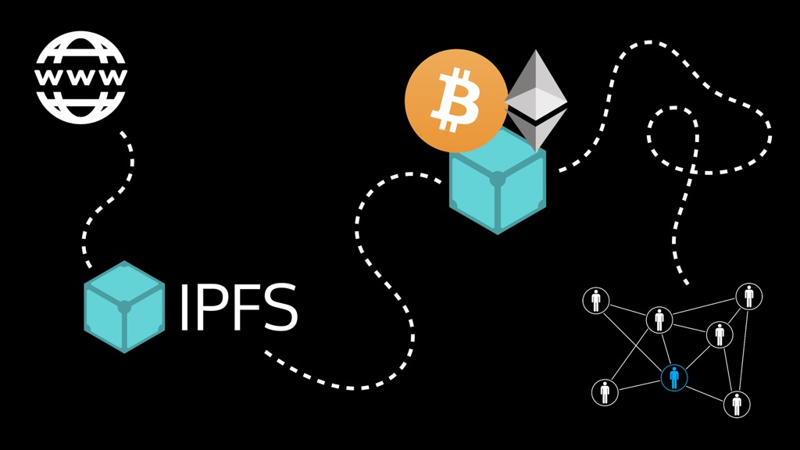
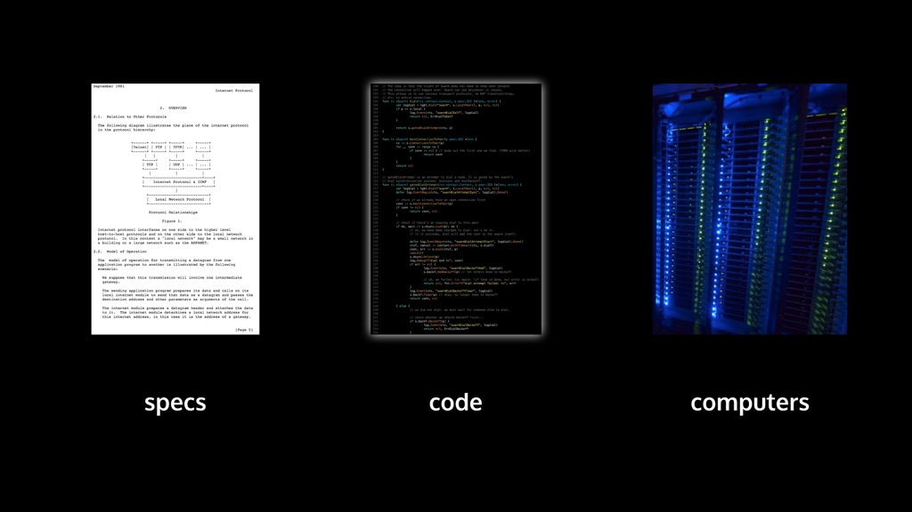
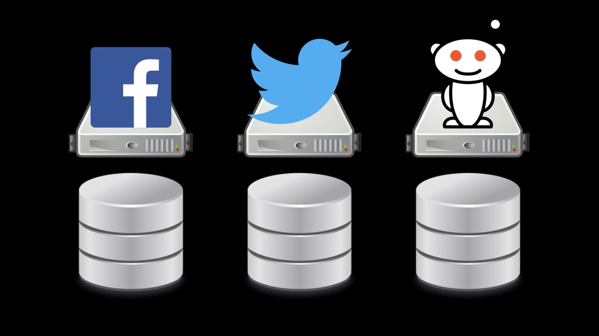
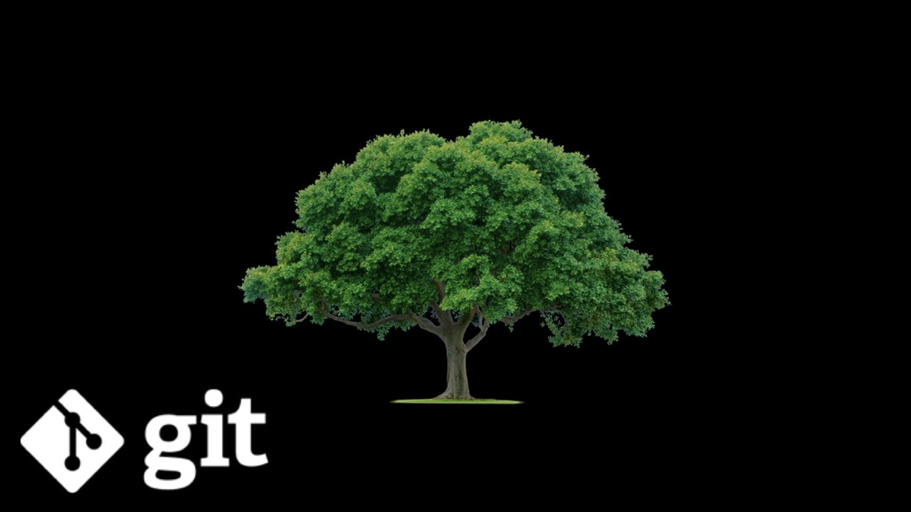
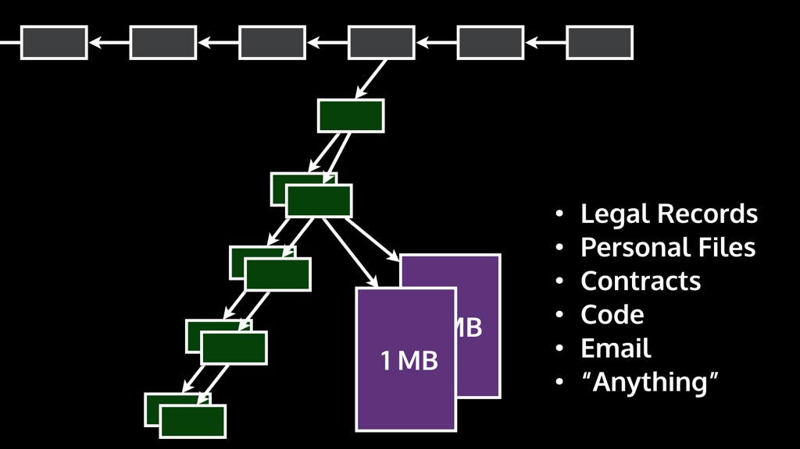
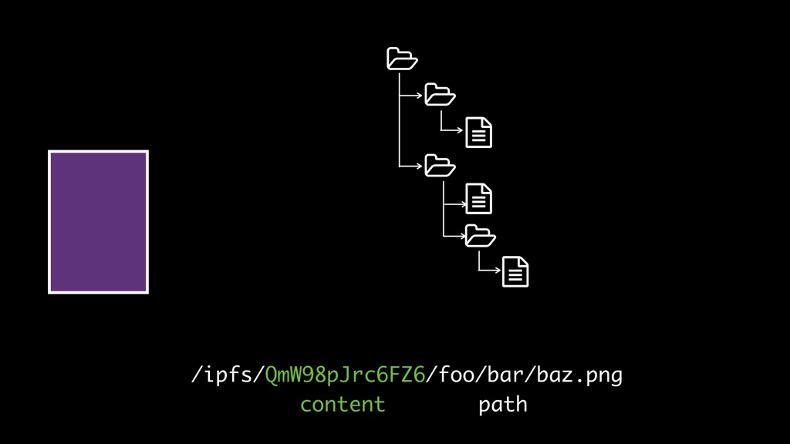
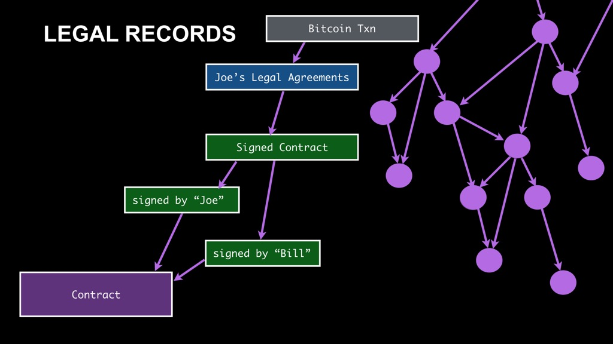

---
# this is the final blog post's id (used in the directory)
# this id is part of the url, and should only contain:
#   letters, numbers, dashes.
id: 24-blockchain-transcription

breadcrumbs:
  - {name: "24-blockchain-transcription", link: "./" }

# the date here should be set to the final publication date,
# on the day it is published.
date: 2015-05-05

# this is the Title
title: Talk from Blockchain Workshop in Hong Kong

# this is the name of the main author(s)
author: Protocol Labs

# technical details required for the software, don't change these.
baseurl: ..
template: tmpl/layouts/post.html
collection: posts
---

<iframe width="560" height="315" src="https://www.youtube.com/embed/tN3ngYje0GA" frameborder="0" allowfullscreen></iframe>

This talk was given at [COALA's Blockchain Workshop](http://hk.blockchainworkshops.org), on October 13, 2015 in Hong Kong. Below, we provide a transcription of the video, along with slides.

---

MC: Well, so. We need actually consensus making on the agenda. We have a fork on the agenda, we have one on the Website and one which is handed out, so I'm gonna reconcile the fork with my consensus rules.

Now we have on the floor on the Distributed Web, IPFS. Take it away.

Juan: Thank you. Thanks for having me. So, quick show of hands how many people know what IPFS is already? Cool, it's a good amount.

So, we like to call IPFS the Distributed Web, because it is an effort to make websites and web applications operate in a distributed context.

Another name for IPFS is also the Permanent Web or the Merkle Web.

IPFS is a protocol to upgrade how the Web works.

But IPFS loves blockchains in general. It's in a sense inspired by the same tech that a blockchain is inspired by, which is the Merkle tree.

And, in a sense, IPFS is also a protocol to upgrade blockchains themselves.

The structure of this talk is that I'll talk a bit about the Web and why there's some problems there that we are trying to address. Some of the things that we have been discussing in this conference will feature there to some extent.

I'll describe what IPFS is and how's structured, I'll talk about how it relates to blockchains and I'll conclude, if there's time, which I doubt, with a discussion on the project itself, because I think it has a lot so say about how the Internet gets patched today, and how major developments happen in general.

I like starting with this image, because it is a very clear construction of the different kinds of networks. This comes from Paul Baran who was one of the inventors of packet switching way back. This is when AT&T and the Telcos were switching from switch lines to packet switching, way before the Internet.
And he characterized networks as being centralized, decentralized or distributed. And the major point here is that, in a centralized network it's easy to think about it, because there's one thing that does all the work and a bunch of clients. Decentralized networks kind of shard that and gained some replication, or some resiliency. But it's not until you go completely distributed and peer-to-peer, it's not until you go where the protocol is the same everywhere and every single entity runs the same pieces of code, or in their case hardware, that you get this kind of fabric that you can break apart in any kind of way and the whole thing will still work.

When you think about the Internet

and the protocols that make it up, there's of course agreement that helped make and formulate this amazing machine that we have.

And it's all really about specs, code and computers, right? We have a whole bunch of ideas that we synthesize into agreements, into protocols. We turn those into code. Which means just taking the ideas into specs and massaging them into a program, and then we run the programs. This means the Internet is extremely malleable, it means that anybody can actually come in and change the Internet, all they have to do is come up with a set of ideas, that are good enough, implement it and ship it. If it's successful, people will adopt it, people will use it and people will eventually make it part of the core of the Internet. This is what happened to Bitcoin, this is why are we here today, because somebody, one person, potentially more, but most likely one person came up with a bunch of ideas, wrote the specs for it and the code and then shipped it. The powerful thing here is that when you think about something like the Web and how difficult it would be to remake and reshape how the Web actually works, it's not actually insane at all to propose to upgrade the entire Web. In fact we're doing it already. We have over 50 and 100 thousand websites that run on IPFS, so that's an example.

All right. So, the Web and the Internet are not the same thing. The Internet is the wires and the Web is the applications on top of those wires and those computers. And when you think about the applications that we run today on the Web, these applications more and more run all of our lives. Think about how much data that you generate which goes into some of these Web applications, not through companies and so on, not through the mail, but directly through Web applications that you're using HTTP to connect to some other computer and send some data and receive some data back. We're talking about your learning, we're talking about your personal documents, your company documents, we're talking about all of the communications that you do with the people that matter most to you, your personal relationships, your work relationships, overall almost everything. Right?

And the crazy thing is that  the Web has some problems and some pretty critical issues that we need to a address before it becomes a major issue.

And one of them is recast this image, is that the Web, though it started in a distributed sense in this kind of this very peer to peer notion that everyone was going to run both an HTTP server and a client, and be able to share documents with each other, it's completely centralized now.

We run browsers and we consume content from Web servers and we talk to the Web servers through these carefully constructed ways, but you as web browsers don't really get to publish data into the network, everything is mediated by a set of servers.

Which also means that if you want to download data, you have to go and bring it down from those servers and it becomes an extremely inefficient mess, right? If all of you right now started downloading Gangnam Style, suppose there are 7 or 8 links in between, we would end up wasting tons of bandwidth.

And if we calculate, based in the number of views, when I made the slide,

- it is about almost 500 Petabytes of data coming off of Google servers, let alone times 8 for all those links depending on times whatever the diameter of the network is.

It gets worse when you think about offline use cases. If all of us were collaborating on a Google document or some sort of application through the Web, and the Internet fell apart, the connection to the Internet fell apart, it would just cease operating. Web Apps are not designed today to continue to operate in the offline case. They're not offline first.

And at the time I made this slide as well, there's all this other very critical pieces of humanity now that just cease to work, if your latency or bandwidth is above or outside certain limits. I think this is unacceptable. I think that we as engineers need to up the game here, and fix this major problem, because it actually is really critical when you think about how people are using these things. We tend to design applications which are supposed to work in the best case, and we hand them out to people and people fall in love with them and they use it all the time. And then, we don't stop to think about what happens when the model of execution that we thought about isn't the one that applies in their daily lives, we don't stop to think about when their connectivity breaks. And that dependence that they develop on the software we created ends up hurting them quite a bit.

And think about all of the devices that people are getting nowadays, and think about Internet things and so on. These things aren't capable of sharing data through the Web at all. They share it usually through native protocols that they implement. The whole idea of this amazing idealized web of documents that we were all going to share and collaborate through doesn't extend into mobile and doesn't extend into the Internet of Things yet. This is another problem. The Web is being kicked out of these devices. The value the Web brought by integrating everything together is being stopped from entering here. This is another issue that we need to fix.

There's of course information silos, when you think about all of the databases out there, in the big social networks, it's really their data, right?

It's sort of your data but it's not really, you sort of have rights on it but they control it. And certainly you can link it to each other, you can't link it to other pieces of data on the Web in such a way that it will remain there, should that Website shutdown or kick you out, or whatever. So that data is... the whole point of the Web was to create pieces of data linked to each other, and if that, all of that is mediated through specific entities then... the utility and value of your data depends of those entities.

I think the people that know this best are the people of Egypt, when suddenly they woke up one morning to the fact that their Internet had been completely shut down. And their communications were gone. People had been communicating with each other through social networks and suddenly nothing worked. So, this is again, another problem when you design a communications system or a communications application and you don't think about what happens when a government decides to shut down Internet access for people, that's a big problem. Of course, thankfully people deployed mesh networks and so on, and they manage to get Internet access back, but that's not a given, and so application need to be built to deal with these kinds of use cases, applications need to run in local networks.

That was a man made disaster, but what about a natural disaster. What happens to the Web then? What happens to all these communication infrastructures when there's earthquakes, floods, super volcanoes exploding, what do we do then? What happens if major disaster happens to data centers and suddenly we don't have our data anymore. The company will say "Sorry, we lost it. It's a natural disaster, we didn't account for that". And, of course, a few companies do, and actually are big enough that they think about this sort of thing and they do replicate your data across a few data centers, but it's not, perhaps as replicated, or as safe as you may believe. And it's not as safe as you may want it to be.
There's also the problem of the book burning. Right?

We have been criticizing book burning as this horrible thing that happens when a society kind of goes crazy, and we see book burning as the ultimate sin against humanity. We see humanity as the product of language, technology and knowledge. Those are the things that distinguish us and yet, some societies burn books and we see this as a trait of things going really, really badly.

And yet today, we burn books all the time. We burn books daily. We burn books everyday whenever you move a document on the Web and a URL no longer points to where it used to. Whoever had a link to it and now cannot see it, for them it is a book burn. For them, they may not be able to find the document anymore. They may not be able to access it. They may not even have a search that works fully. So...

The critical point of the Web, which was to create this idealized notion of documents linked to each other, has a problem.

These documents are documents on computers and you can burn those links, and you can burn those computers too.

So, these are some of the critical, critical problems that I hope I have inspired in you a sense of the urgency of these matters...

and why it is important to upgrade the Web.

So, IPFS is this project to make the Web work in a distributed case, work in offline first, be more permanent, be safer for the user to move the content around in a smarter way, and of course be faster, because if you don't make it faster, no one is going to use it. Actually, this all started by trying to make it faster and after a while all of the other properties just kind of fell out, which is cool.

IPFS is a hypermedia transport protocol, the same thing as HTTP, and the goal is to match the interface exactly. Things shouldn't have to change, web applications should not be different at all, you should still be able to run anything that you run on HTTP over IPFS with minimal to no modification. Some things will be harder, like more complicated web applications will be more difficult to translate, but you'll gain some very interesting properties.

IPFS is a product of looking back through the last 25 years of developments, since the Web has been created and thinking about what the Web would have looked like today if those ideas had been around when Tim Berners-Lee invented the Web. So, we've come up with a whole bunch of good ideas, since the invention of the Web. What would it look like if those kind of things made it in. And you may think because we're at the blockchain workshop: Why isn't Bitcoin there, why isn't the blockchain part of this? Well, Bitcoin and blockchain didn't come up with Merkle links, that was kind of an older idea, so, it would have made it but it was kind of already done.

These protocols kind of separate out into a stack. The Web is of course the great application platform that we know. SFS was a fantastic protocol that made sure that we had a secure way to do naming. Git gives us the whole notion of versioning of data and Merkle links, that's where I learned about them, they're even older, but I learned about them in Git. And of course, BitTorrents has this amazing way of moving around contents very efficiently through networks making it easier for us to find content.

And the whole thing is designed to let it work over any network, so, this is not true of HTTP. Actually you can make it work over any any transport, but in general most Web servers just don't do that, they only work over TCP. So if you wanted to run the Web over Bluetooth, if you wanted to run the Web over audio, or something like that you'd have to work really hard to do that, which means that nobody does it.

The stack breaks down into these sections, something we're calling libp2p, which is a set of protocols that a whole bunch of other projects could use, and really the core part which we're nicknaming either the Merkle DAG or the Merkle Web or IPLD. That is the core part of the protocol.

The idea is to come up with one core format that makes sense for all of these distributed data structures, for all these distributed systems that want to interact through the Web, through the network and address content with each other and move around. And so, the stack here, there's a set of protocols in this stack that you can see, that are IPFS specific, but the whole point is that you could swap them out, you could actually use HTTP as an exchange in IPFS, you could use other kinds of of transport like WebRTC or uTP and so on. And you could have a version of IPFS working entirely over TOR and I2P, which is really critical when you think about preserving privacy and security in the Web for people.

In a sense, this is the Internet of data. IP was such a good idea
because it created this thin waist around the IP protocol. We're doing the same thing but for data itself. We're coming up with the thin waist of what it means to define these data structures that are distributed.

It's not just data, it's data structures. You need a way to express data structures in the same way that other people express them today.

And if you have ever used Git, you know it's a Merkle tree or something like it and, I won't explain fully what a Merkle tree is. If you've heard about a blockchain, the whole idea is that you have some block and you have the hash pointing to a previous block and that creates this chain of links. That's all that a Merkle link really is, and that's the property that we care about.

The point is that Git and a whole bunch of other protocols have these different trees, they have all these different separate repositories of information.

And even Bitcoin and blockchain are this massive Merkle trees, this huge chain, all in the way you have these Merkle links.

IPFS is a Merkle forest. The whole point is to bring together these distinct different systems, by coming up with the same way of linking between them.

So you can think of Bitcoin and Git and the BitTorrent and dat and so on, as pieces of the same system as a whole, the Web, basically. This is what the Web is supposed to be, a way to link between these things: we're just making it so that this other really cool systems, and important systems can continue to do what they do best, but still preserve linkability.

When you think about blockchains today, you can also think about Ethereum also emerging as this other massive blockchain, right? You can see this massive Merkle forest that we're helping to create.

And, again, the point is to upgrade the Internet, upgrade the Web, in such a way that we make the developers life easier. Because, ultimately if you make an improvement and you manage to make it, make some really complicated thing very easy for developers, you succeeded. And that's how you achieve progress on the network. If you come up with a protocol and it's really great, but your implementation isn't helpful or friendly to developers, thanks but try again. It's not gonna move the needle, it's gonna have to wait until somebody else manages to bring that down.

So, I mentioned that IPFS loves blockchains. This is because a blockchain it just a Merkle link data structure, like any other, which means you can put them entirely on IPFS and use it as a transport.

When you think about a blockchain, again, you have this block with some data

you have another block pointing to the previous one

and the key part here is that there's some link that is a hash, so the block on the left, when you hash that you get the value that goes into, that is included in the block on the right, and this is

a Merkle link.

You get the ability to check the integrity of this huge chain as it's forming through that property. Of course, blockchains have this additional thing or at least the protocol of Bitcoin, the blockchain has this extra thing where you try do this proof of work to figure out or solve a puzzle around the hash being under a certain target difficulty and so on, but that's not that important for IPFS, the whole point is that it's a transport for Merkle data structures.

When you look at a blockchain, it's pointing to a set of transactions, right?

These are all still Merkle links.

And the transactions that aren't yet included are sort of in a pool somewhere, and the process of extending the chains is taking the transactions that are valid and putting them into blocks and extending the chain.

What happens when you want to include data on the chain that doesn't fit? We've talked this entire conference about including things like contracts, and records, and important documents and so on in a blockchain but you can't actually put it in there, through a transaction, because you don't want every single node ever to have to store it, so, you do the same thing that the blockchain does, and you put a hash to it as a link, right?

But, this content, which by the way is starting to be all sorts of stuff, there's like legal records, contracts, code, emails. I've seen email over Bitcoin, pretty much anything right? But what happens with those links? You can't click on a link like that. There's just some hash and now you have to take that hash and figure out what other system, it belongs to.

Some of these files are getting huge, like I've seen some massive archives' hash in there, because you want at times important details, the problem though is, how do you make sure that all of the content remains addressable.

If you were to put a link to HTTP there, then you don't get any of the integrity that you wanted because, of course, anybody could change the server or something and the file will be different.

And again, to review HTTP for people that don't recall how it works.
You have the Internet, you have a whole bunch of servers, and if you want a specific file

you have to talk to a specific server to get it back, or a specific set of servers. Even if a whole bunch of other computers in the network have it, it doesn't matter, you have to go talk to a specific one. And there's a reason for this, it made sense at a time but maybe not anymore.

So, of course if you want to put in a blockchain you don't do that, you put the hash of the content.

So, why don't we build a system to just address everything by hash, and yes, there are some already, but the point is that why don't we make the Web itself work this way, and this is what IPFS is about: making the Web itself work with a hash based file system.

So, instead of this picture, you get a picture where any node that has the content can distribute the content to you, because again, you need no trust. It's the same thing you get in BitTorrent, the same you get in Git, the same you get in Bitcoin, blockchains and so on.

The benefit is that it

is a file system, right? Like we're talking about is good to store records and documents and directories, and so on...

And the resolution works exactly as you would expect it to work in a file system, the same way that you would expect it to work in the Web. You can have directories that point to other objects and so on. This is exactly what Git did and why it became so successful.

These are of course Merkle links.

And if people kind of know or think of what Git did and why it was successful. The whole idea was that there was a previous version controlled system called SVN and before it was CVS and so on. And the model was centralized, you had one server maintaining your versions and everyone would talk to that one server. If you were to make any update you would have to ship that update to that server.

This was not very robust or resilient. If you cut any of the links, you couldn't talk to it, so you couldn't work, you couldn't make any update. If the central server went down, of course, everything fell apart.

Git's improvement was to make the entire thing distributed, to make it offline _first_, this is the same thing that Bitcoin did in a sense. Any node in this network is capable of maintaining its own record of the versions and talk to each other.

So if part of the networks goes down, it doesn't matter, anybody can still work and you'll sync back when you get together.

If the servers go down, it doesn't matter at all, you can still work and talk to each other,

This is what IPFS is doing to the entire Web. We're moving the Web apps and websites and documents, and archives, and everything that you can touch on the Web to work this way.

It's what I call hyperspeed, because it's really fast. If you download something and you have it locally and you have the hash, you never have to download it again, you beat the biggest problem which is the speed of light. So it allows you to think very differently about how you move content through the network, and it allows you to move things preemptively, to have caches that are not trusted and so on.

So, IPFS is creating this massive mesh, this authenticated mesh, where any piece of data can point to any other piece of data through a Merkle link, and the critical thing here is that you are not pointing to an HTTP server which may change, you're pointing with the cryptographic hash, which means you know exactly what piece of document you were pointing to. It's what everyone here wants out of the blockchain, or some of the things people want out of the blockchain. As I listen to people talk throughout the blockchain workshop, many people that are interested in blockchains, not from a smart contract sense, but as a way to store data - it is the same thing, you get the same kind of properties here.

This is a different way of thinking about how to store information. The important property of a blockchain is that timestamped, right. You can think of putting data on IPFS, and taking the root hash from IPFS and time stamping them into the blockchain, and vice versa. You could take the blockchain itself and put all of it on IPFS.  In fact there's people who are trying to build blockchains that are designed to be entirely on IPFS, because it makes people's life easier , you don't have to work through all this peer to peer stuff that is difficult.

So when you think about websites today, they work kind of like this, there's a whole bunch of servers that talk to each other, and of course there's clients too, and everybody has a big database and the data is kind of within the databases and that's it. And you talk to each other over these wires, but the problem is that all of that data is really interlinked, but those links again refer to servers. In the IPFS model, it's about putting this on it's head and saying: let the data connect to each other and so on. And, of course, if anybody remembers linked data and the Semantic Web, this is the same idea -- let data connect to each other. The one issue, though, is that the link data was still dependent on those links, still dependent on those servers, it's still addressed by, mostly not all linked dat is addressed this way, but the large majority of linked data is addressed by those locations, so it makes it extremely difficult to work with because those links can go down, you don't want to query like 20 servers at once, and so on. What you really want is something like gGt or the blockchain where you can take entire portions of data and move them to one location, even completely go offline and still have everything in operation. It's about deprioritizing the servers and the websites and really thinking just about the data.

And when you think about Web application data, you could  think about this huge graph of content, instead of making this only your Web application as content stored in some like model in a database through SQL, you make a Merkle object where the links that you're linking between those objects and each other are Merkle links. Which allows you to get all of these other properties, all the cryptographic verification and so on. And you can sign all of this stuff as well, then get even an extra integrity check, which is you can see who generated the stuff. This is amazingly useful if you want to create any kind of distributed website, where users are creating the content and moving it around for you.

And you can do, of course, legal records this way, you can have a contract as a Merkle link, by a signature, and then the signed contract turns into pointers to those signatures, and like a legal agreement, or, my legal agreements could be just pointing to a whole bunch of signed contracts, and I could take that root and just timestamp it into the Bitcoin blockchain every once in a while, and keep a record that way.

So, it's this massive mesh that it's really all about. It's about creating this distributed network where data can link to each other with Merkle links, and you can move it around pretty easily. Turns out to be a lot of...pretty much like the barrier to this is making new ways of, like basically matching all the interfaces that people are expecting, out of how you make Websites and Web applications, but making them work with this kind of distributed effort.

Hopefully I've explained what IPFS is about. Let me check time and see how we're doing. Super late. I'll take a couple of minutes to tell you about the project itself, because I think is important.

So this started because I wanted to build a versioned data set packet manager, I wanted to make it easier for scientists to move around data and simultaneously I also wanted to make some sort of storage layer for some sort of distributed agents, that they could talk to each other, but that was kind of like a secondary goal. And I was going to into merging Git and BitTorrent, I realized that you could just actually sink in and restructure how the data structures worked, make a better protocol and use that instead. And as I started thinking more and more about it, it became clear that this had vast implications for the Web itself, and it's only sort of after the fact that this became clear.

The interesting crossover with blockchains is that it can serve both as a way to give links to all the blockchains out there, and as a way to put the blockchains on there itself, so it makes implementations easier, but it also makes it easier to talk between blockchains. So, if you have a link from a Bitcoin transaction to an Ethereum transaction, you could make that through IPFS and it would be way easier because they're same sort of links. It's again about creating this thin waist where everyone can have one way of formatting data and if you pull out one thing everything can talk to each other again, all right? Let's not break the Web.

This is of course, all open source, as all important protocols should be and there's a huge community now behind this, I sort of started it, but even the ideas came before me. This is kind of the product of decades of thinking and engineering coming from really good people. My task has been mostly integrating ideas for producing a good interface that matches all of the pieces.

There's a large community on it already, there's tons of users.

Hundreds of contributors and also, quite a bit of traction already. We describe our project as an alpha and yet people are using it in production over the place. Like I said 50 to 100 thousand websites on it. There's tons of different blockchain or Bitcoin or Ethereum related companies which are using it. It recently was shipped in a very large provider of network devices, with a massive install base so that will be interesting when that comes online. It's gaining a lot of traction and moving really quickly, which is great, but at the same time is kind of important to keep... to step back and to think about how this project is moving forward and say what made it successful, where so many other projects that tried to do this in the past weren't able to garner a lot of interest. It's critical for those people, like you, who might want to create different protocols and get other people to contribute and help push them, it is critical to think through the whole thing and think about how it's going to interface with all the other project out there and every single thing that people touch. And if you can generalize, and generalize, and just do this over and over again, you end up with something that's very small and very simple, with all these pieces that will make it usable to other people, but then you'll have something that actually works and that people can get behind. I think, so many times people don't do this.

I started a company to build this out, because I wanted to have like an independent group, and I think this is another thing that's important about how this protocols emerge. When you think about Bitcoin, it was a person, anonymous, put it out there. When you think about Git, it was built by the kernel hackers, not a company. When you think about BitTorrent it was one individual, and so on. Critical pieces of the infrastructure of the network are emerging from all sort of random places, because really good ideas come about, people have someone to carry them out and build them, and deploy them.

But what I want to build is a Lab where... it's completely open source and people can come together and work on things, no matter what organization they're part of and sort of like a strong arm for the IATF, a group that can take the moment to look at the whole Internet stack, think about what's missing, what would be really important to add and then just do it. So, that's what the effort behind IPFS is becoming, think about creating a Lab like this, we call it the Protocol Lab.

Kind of like Tesla meeting the protocol stack.

If we go to back to the slide about spec, code and computers. The problem that we have today is that so much research exists, and it's great, it's amazing that there's so much research and so many good ideas but the issue that I see often is that academia is 25 years ahead, it's light years ahead, it's like alien technology to us, to us mere mortals. And the issue is that, so much of what we are talking about today has been solved already, by academics, decades ago and why are we not seeing those results today, and it's because this funnel is broken. It's because when we go from research to development there's a huge gap, most academics come up with really good ideas and move on to the next paper, but very few people actually take the time to implement those pieces of ideas into a system. Then, beyond developing something, from going from development to deployment there's huge, again, a huge filter, because very few things are actually developed well enough to be good engineering systems that people can actually use and will actually use. And beyond that, even after you developed something, even after you deployed it, if you don't think very carefully about how to launch it, if you don't think very carefully about how to get people to kindle the fire of using it, it just won't happen at all and it'll die again in the dirt.

So, but the time it gets where people use, it's been filtered so many times by this very huge probabilities, that we get almost nothing. And so, I urge all of you who kind of presented and talked about problems, that have technical questions to read more literature, because it is just filled with the answers that you are seeking. It's just that it hasn't been deployed in such a way that you can use. Focus on that.

This is kind of what I'm building Protocol Labs to be, a research and development and deployment outfit that can fix this filter to some degree. So, anyway...

This is the IPFS Project, how it relates to blockchains and so on. Thank you.

MC: Stay there for a moment. I have some techs to introduce you that may help with that. I  do want to enable some time for questions, maybe have one question. Ok.

Audience member: I have looked only a little on IPFS, it's a very interesting project. My question is that, it looks very good for like static content, what about dynamic content, for instance if I have like a twitter, like if I go to twitter generates on the fly my newsfeed, and...so I don't know the content, so I can't know the hash beforehand...

Juan: Yeah, so, I'll describe it in terms of Git first and maybe that will make sense. Git has a whole bunch of static content inside and a branch pointer just moves to do mutability. You have this massive amount of static content, but what you need to do to get mutability is that you need a pointer that can move somewhere, that is not only a mutable content pointer, it's a mutable pointer. And we get that with naming, we call them names. It's like Git branches, but we call them names, and so, if we go to the slide way back about the links, here we go. You see that I have `/IPFS/<a hash>` that is a hash made on the content of a file, and above it's a thing called `/ipns/`.

For name space, and there is a DNS name “example.com”. What that means is that there's a DNS record out there that has the latest version, that has a tech record pointing to that content. Of course, that's not the best solution, you don't want to wait for DNS resolution to get updated, you want it to be less than a second, ideally less than milliseconds sometimes, and you get that through another layer which I don't show here, but that's where SFS naming comes in. A name or a branch in IPFS just means the hash of a public key, so, if you have a private key, that means you can create a pointer to some content in IPFS and publish a record to some system and people can trust that name, so, that name is ugly right? There's a huge hash is not a nice name, but people can trust that name because it's authenticated, right? It's like the name itself is the hash of a public key, from that special key they can verify it, that you sign the record correctly.

Audience: Like an onion URL?

Juan: Yes, exactly. SFS naming is all over the place, it's in Onion, it's in Freenet, Newnet, TahoeFS... there's tons of things that use it. And these are, by the way, other projects that are related to IPFS and have been thinking about the same sort of ideas, so definitively check those out and if there's anything that we should do better, please come tell us, because we want to do the best thing possible.

MC: So, for all of you Merkle DAGs you get the next 20 years where you can play around. This is absolutely awesome. Thank you so much.
