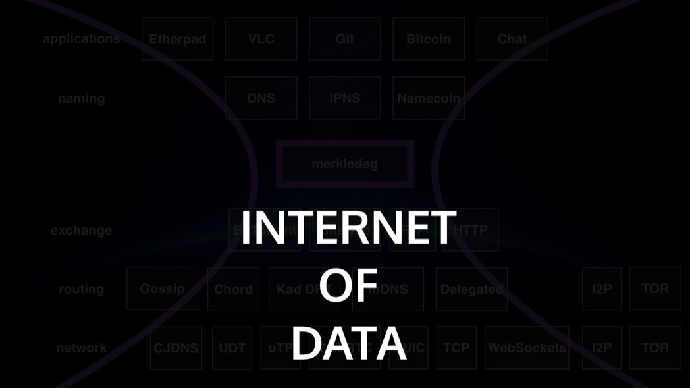
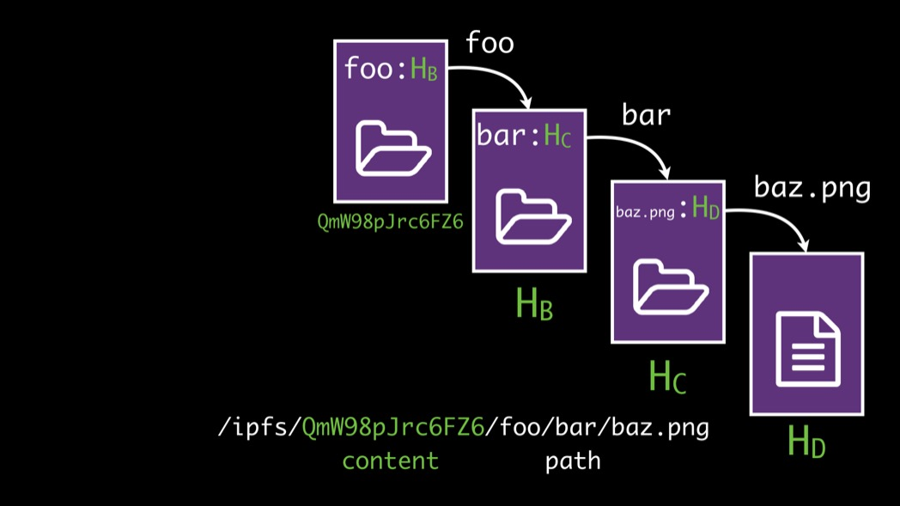
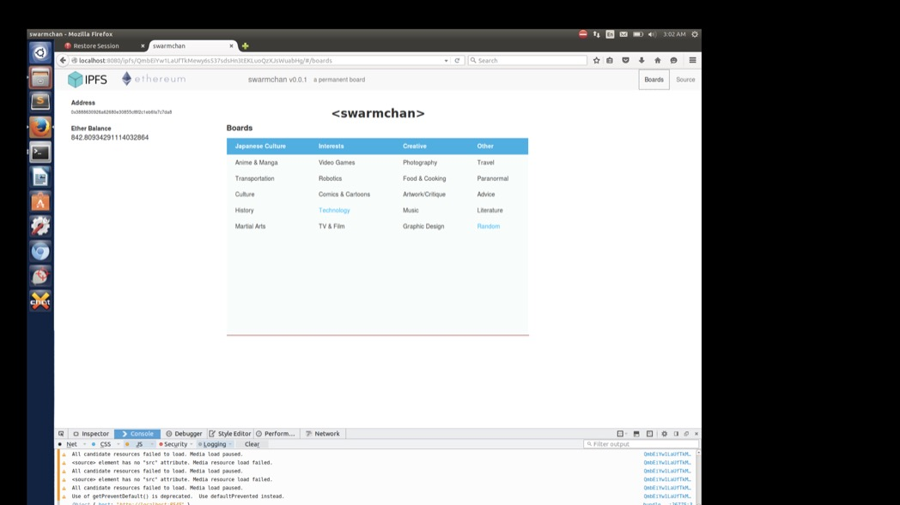

---
# this is the final blog post's id (used in the directory)
# this id is part of the url, and should only contain:
#   letters, numbers, dashes.
id: 27-devcon

breadcrumbs:
  - {name: "27-devcon", link: "./" }

# the date here should be set to the final publication date,
# on the day it is published.
date: 2015-05-05

# this is the Title
title: Ethereum DevCon1: Introducing IPFS

# this is the name of the main author(s)
author: Author Name

# technical details required for the software, don't change these.
baseurl: ..
template: tmpl/layouts/post.html
collection: posts
---

At Ethereum DevCon1 in London in November 2015, Juan Benet gave a talk introducing IPFS, and providing examples of how distributed datastructures could work for various Ethereum use cases, from off-chain data, to the chain itself. Here is the video, with a transcription below.

<iframe width="700" height="400" src="https://www.youtube.com/embed/ewpIi1y_KDc" frameborder="0" allowfullscreen></iframe>

All right, shall we begin?

Let's do it. My name is Juan. I'm one of the people behind IPFS and today I'm going to talk to you about data and data structures.

So the talk is structured this way - I'll give you a brief introduction to IPFS - actually, how many people here know already what IPFS is?

(Show of hands)

Wow, awesome! That's a great distribution! So, that'll go really quick. We'll cover the IPLD data model and then we'll talk about Use Cases & Examples of IPFS and data structures and so on.

### IPFS Introduction

All right, so IPFS! Another name for it is the _**Distributed Web**_ or the _**Permanent Web**_ or the _**Merkle Web**_, in honor of [Ralph Merkle](https://en.wikipedia.org/wiki/Ralph_Merkle).

In a sense, it's this kind of evolution of how the Internet and the Web are structured, and I think everyone here - both coming from Blockchain history through Ethereum and a whole bunch of other interesting technologies that are happening right now - sort of sees what's going on or what has been going on for the last 3 years as this total reinvention of how to do distributed computing and distributed networks in general. This is, of course, layers on top of the old Internet and so on, but what's _really_ happening is we're taking the Web applications of the Web 1.0 or Web 2.0 world and we are separating them from their physical location in servers and so on, and distributing them across different hosts.

**IPFS is a protocol to upgrade the Web,** because the Web has some problems. I won't go over these. I think most of you are familiar with them: it's inefficient, doesn't work offline, links break, there are central points of failure, and so on.

The gist is: what would the Web look like if you took a Merkle tree or Merkle chain and put it underneath the Web itself? What would happen if you gained **immutability** for distributing content on the Web?

You can think of data structures like Git's and the amazing power of distributed computing that you get out of that through version control.

You can think about Ethereum and the amazing powers of contracts and running programs in a distributed sense,

and of course, before Ethereum there was Bitcoin, and so on. All of these are Merkle trees.

IPFS is a **massive Merkle forest.** That's the intuitive description of IPFS. It's saying, let's write one transport protocol to layer underneath the Web, and other protocols as well, and build these distributed data structure transports that are all Merkle-addressed. Cool!

Imagine being able to link across different Ethereum chains, and being able to link across Bitcoin and Ethereum, and being able to link to Git repos, and being able to link to BitTorrent, and being able to link directly into a specific commit inside GitHub so you can create a contract and say whoever patches this commit or something successfully gets the money, or something!

In the IPFS world, which is a world on its own, there's a whole bunch of different protocols. We have this view of the world that looks a little bit like this, with a whole bunch of different sections for these protocols, on top of the lower level network. This, of course, all sits on top of IP -- although it doesn't need to, on top of transports, on top of different ways of doing routing.

We want to layer what we're calling **IPLD**, which is the Merkle DAG or the Merkle Web, as a **common data structure** that we can all use for expressing all our data structures. It's the same idea as the Semantic Web but instead of just having an object definition, imagine if the object definition _linked between objects with **hashes**_.

That's the heart of IPFS, that's the core. What happens when instead of having a URL that points from one object to another using a location, what happens when you point using hashes?

And this idea is old. It's been around for a while, but this talk would be mostly about sort of what we're loosely describing as the Internet of data or the Internet of data structures to write on top of IPLD.

You've probably seen something like this -- take the original HTTP world of mapping a DNS name to an IP address,

which looks like this, where you're resolving through the network through a specific host.

Instead, you say, "Hey, lets just take the hash of the content itself and use that to address the files."

Instead of that, you get something like this where anybody in the network that has the file can serve it to you. This is all super intro IPFS stuff.

In a sense, what's really going on underneath the hood is that that hash is a pointer to a directory. You can retrieve the directory because you can check, you can ask the network for the directory, people can return the directory to you, you can check the content and make sure it matches the hash. That way, you don't have to trust anyone.

And within that, you look for `foo`.

What that means is that inside that object `foo` is a link that is pointing to another hash and you use that to resolve for the next step and so on down. This is taking the idea of a file system with inodes but _replacing an inode with a hash._

Of course, this is Merkle-linking. You get full path reversals down this kind of graph. If you imagine a Blockchain layered like that, you would have a massive path going like parent-parent-parent-parent-parent-parent and so on down. Imagine you'll be able to index directly into a specific block and be able to go down into the transactions and so on.

The IPFS link sphere, I guess, is that you first have content addressed links, where they start with `/IPFS`, then you have a hash and then the rest of the stuff. By the way, those are shortened hashes. I haven't yet found a way to compress information magically. That's supposed to be a sha256, but it's shortened so it fits here.

Of course, we have the scheme identifier if you want to use it, but we recommend that you _don't_ use the scheme identifier because the way we look at the world, the regular W3C-based scheme identifier broke compatibility with Unix. We're making everything so you can layer it directly on top of any POSIX machine so you can **mount it directly.** You can mount IPFS and you can fetch data, write data to the network with standard old-style applications. You don't have to teach them to speak over some other protocol.

On top of the Merkle-linking -- which is sort of like a "URI", and I say URI with quotes because we do prefer people not use the scheme identifier -- we'll have everything working and resolving with just straight-up paths.

On top of that, we're calling also **Mazieres links.** This is for [David Mazieres](http://www.scs.stanford.edu/~dm/), author of Kademlia, author of Stellar, and author of SFS way before that.

He came up with a great idea in SFS. I won't go through the whole thing but the basic notion here is that the way you achieve immutability in IPFS is that you _use the hashes of public keys and you use those to resolve for pointers that have been signed with a private key._ It's explained better somewhere in the Web. There's more interesting stuff here, but it's a very subtle idea that gives you a way to achieve naming, and this is naming that is not human-readable. It's a way to achieve naming that is cryptographically-addressed or cryptographically-mediated instead of through some central authority.

On top of that immutable link, then you can layer names. Here's the old-style DNS world. We work exactly with DNS so you can add a text record into your domain and now you can resolve through IPNS or directly to IPFS.

Of course you can have Ethereum names the same way. You can imagine resolving Ethereum names directly into IPFS content the exact same way. What's amazingly interesting about these kinds of names is that you no longer have to have any machine running yourself. You can create the content and add it to the network. You can create the key names and assign content and distribute to the network. And then you can register some name and point it to the hash of your public key and now you can just disappear! Just add content to the network and walk away, and if the network will continue serving your stuff (and you know, that's an asterisk there), everything will continue working. That's something that's very different. You don't have to maintain your own infrastructure.

This is often not obvious, so I'll go through the IPFS content and replication model. This is kind of like what most people don't expect to hear. They're like, "What?", but it makes sense to go through it.

So there are 3 important points that bear mentioning here other than a whole bunch of others, so you probably can assume them. Number one is we want IPFS to be able to go fast as the underlying network. We need to allow users to dial between efficiency and privacy. As you know, systems like Tor, i2p, and on -- that are focusing on privacy -- have to do a whole bunch of work routing packets and moving them around. You spend a bunch of bandwidth hiding the traces of people accessing the network. This is how you achieve privacy. But that's not fast. You're trading off the speed of transfer there to gain some privacy.

But the users of IPFS are varied. Some people really want that use case and layer IPFS directly over Tor or i2p. Some users don't care at all about that. They're using IPFS inside data centers or using it in some other way and they really want it to be as efficient as possible. Do you really need to route through Tor to go from your computer, your laptop to your mobile phone in the same room? Maybe not. Or maybe you do! (Ha!) It depends on what kind of home you have, but you know...

Another point here is that IPFS **only downloads explicitly requested data.** You do not download other people's stuff, and this is an important piece from a legality perspective. There's been a whole bunch of problems around peer-to-peer systems where they download other data as part of the peer-to-peer algorithm. And they end up downloading stuff that's illegal. This prevents the adoption of these sytems in companies, because companies just cannot afford to do that.

In IPFS, those are policies that are expressed and those can be added on top. If you want to organize a cluster that moves around and shares data and so on, you can do that, but that's a policy that is layered above IPFS. So, there's a strong commitment there of being able to say, "Look, you can use IPFS and not have to worry about what other people are adding into the network."

IPFS is able to follow what the user programs in, so these policies that will be... we haven't done as much work here. We'll be doing some interesting stuff there to be able to express how you might trust other keys and trust the content from other keys and be able to give people capabilities to add stuff to your node.

On this "only downloads explicitly requested data", this is a huge surprise for most people because they think, "Wait, what? You have this distributed file system, it's supposed to be peer-to-peer. If I add content, how do I back it up? What if it disappears from the network? It falls off."

The idea here is when you add content to the network, you're explicitly publishing something. So the rest of the network has an option: either they spend energy maintaining this online or they don't. If they do, it's because they care about this thing. If they don't care about what you have to say because what you say is not that interesting, then you can just pay them to care.

And this is where something like Filecoin comes in. HTTP maps to IPFS and AWS S3 maps to Filecoin or Swarm. Or really AWS and Windows Azure, and so on. How you maintain stuff in the network is a separate part, different from how you move stuff in the network. IPFS is strictly about how you address and move content in the network. These protocols around incentivized, organized distributed storage - those layer on top of IPFS.

An interesting thought is a lot of people say, "Well, how could you ever hope to compete with something as big as Amazon and Google and Microsoft and so on, which have these massive infrastructures?" I just point this out. This is the hash rate of the Bitcoin network and the massive spike. This is what happens when you get an economic model coupled with a very easy to enter market. Somewhere along this graph way before the knee, the hash rate of bitcoins surpassed the equivalent of the world's most powerful supercomputer, and then the world's top 500 supercomputers put together, before the knee of the curve. So that gives you a sense of just how insanely powerful the hash rate of that network is!

Sadly, all that is going to waste, so hopefully we'll get Proof-of-Stake working correctly so we don't have to waste this. When you think about this model and you apply it to doing something useful, like storing content, you can get an **enormous** amount of storage wired up into the network. You'll see. Mark my words. In the next year and 3 years, you will see _enormous distributed systems with storage_ popping up into the network. They're already getting started; it'll come. You'll have something that looks like this, which are the Bitcoin Mines, but for storage.

### Dose of Web Reality

Now that I've kind of made a claim about the future, let's have a dose of Web reality today to cleanse our minds.

These are strictly Web 1.0 and Web 2.0 companies or websites in general that I put up there. These applications kind of run your life. Everything that you do nowadays revolves in some way around these applications: your personal communications, your work, how you learn, how you get stuff, how you buy food. Everything is now mediated not only through the Internet but through specifically Web applications.

This means that all of your capabilities are tied to specific organizations maintaining specific infrastructures online. It's kind of scary. Right? Those could disappear at any moment in time. Or those could just stop wanting to serve you or.... I like pointing these out especially in this crowd because this is the competition. If we want to push this very different model of computation, a very different model of storage, and actually upgrade how the Web works, we have to work equally well at least and ideally better than these systems. In fact, not only do we have to work equally well or ideally better, we have to have much higher performance, or none of these people will adopt this stuff. This is what I mean by a dose of reality.

When you think about the data that you have on the Web today, you have these massive infrastructure providers that have huge high-performance databases. The model is that people have these business logic services and they have to maintain them. This is where perhaps these systems can come in and change them on our way, and people don't actually have to maintain infrastructure themselves. It becomes a lot cheaper if they don't have to do that.

But this is the competition. This is a diagram from Amazon itself. Think of how many machines here are involved in just 1 application. If you're a legit application, this is what you do. You have a DNS resolution machine connected to a CDN connected to a bunch of static content buckets connected to a whole bunch of Web servers that autoscale, connected to routers which hit your application servers, going all the way to the databases. It's madness! This is all for optimizing really fast accesses in the network. When a user hits your webpage, they have to get the stuff within a second or it's Game Over. They'll leave and they'll go somewhere else. This is the beast lying in the center of the backbone just to be able to manage that.

We have this enormous explosion of databases:

the constraints around being able to do billions of transactions per second, handling billions of users, millions or hundreds of millions of simultaneous users for the big ones, sub-100 millisecond latencies from the backbone to the user, or ideally just from the user to the application. And we're talking about terabytes, petabyte, and exabyte scales - terabyte scales if you're a small company, exabyte scales if you're basically Facebook, and so on.

When I hear "BLOCKCHAIN TECHNOLOGY!!", How is it going to deal with this? What? *What!?*

But! Here's the magic: the thing is it's not about matching the capabilities today. It's about proving that those capabilities can be achieved, but _complimenting them with a whole bunch of capabilities that weren't there before._

The idea behind Blockchain is being able to do multi-party computation that's verifiable and trustless. You don't get that at all today in Web 2.0. Being able to do trustless ledgers, being able to count the things that are actually happening. Timestamping. Being able to run contracts that are verifiable. You just write the source, get it out there, put it up there, and then it just runs on its own. You don't have to maintain it. Nobody has to do it. Being able to write decentralized and distributed applications, things where you write them once, you sign them, drop them into the network and disappear, and people can carry them on. You could disappear as an organizational company, and people could continue to use the application. These are real capabilities that you give people that you cannot take away. And that's extremely interesting. That's where there's a completely unfair advantage compared to the Web 2.0.

We're talking about taking data and code and execution in a completely different verifiable model and of course being able to do security and encryption in a way that Web 2.0 people can't because a lot of Web 2.0 relies on advertising and so on, which means that they can't really do end-to-end encryption. So that's a **huge** advantage, right? Because we don't have to deal with that. We can just do end-to-end-encryption for users. We don't need users there at all. This is a strong reason to be able to move in this direction.

Web 2.0 is kind of about having these databases talking to each other with data behind the scenes.

Web 3.0 is about taking the logic and data itself and putting those into the network and allowing those to communicate and making the actual hardware secondary.

All right. That was the interlude... I have to rush through this stuff!

### IPLD Data Model

IPLD - this is the heart of IPFS. It's a common format for hash-chain or distributed data structures based on Merkle trees.

What I showed before with these files - these aren't actually files. When you add something to IPFS, it kinda looks like this. You add all this stuff...

But these aren't files. These are actually nodes in a graph.

They're stored in a format that we are calling IPLD that is basically like JSON. It's not exactly JSON because it's serialized to be fast. The whole point is you have a very flexible data model. You can take entire APIs of today and just dump them straight into IPFS. You can take some data API that you have and just straight-up import all of that into IPFS and Merkle-ize the whole thing. That is not perfect and you have to work hard to make it really a good distributed application, but that's Step 1.

We see us as the new "thin-waist" of the Internet of data structures.

It gives you Merkle-links that are secure and immutable. It gives you Merkle-paths, meaning you can resolve through the graph. They're sort of universal and they're kind of URIs and URLs, as we said before, though it's not location-based. (I mention URL here because most people are familiar with that term but it's not actually location-based.)

In terms of serialization, you can do anything you want. You can use JSON, Protobuf, XML, RLP, whatever it is that you use, you can use a serialization format underneath the hood. There is a canonical way of describing which serialization thing to use so that everyone hashes the same thing.

So, if you had something like this in JSON where you outlined the followers of a user this way, this is kind of like mush. What does @VannevarBush mean? It's some user somewhere, but you don't know what context that comes from. You have to know that this would be Twitter or something else just from the endpoint that you're accessing this from.

But what if these actually linked to content-addressed things? The resources were actually based on hashes. Then you don't have to know anything about the way you're accessing at all, because the content itself tells you what it's about.

With IPLD, you can do YML, you can do whatever format you want, and so on. The whole point here is to build something as easy to use as JSON.

But, when you Merkle-ize it and you turn these normal graphs, you should be able to have the exact same architecture of your data, but where before you would just have some strings that you would have to look up in a database, here you have hash-links.

So you can resolve through the hash-links. Here in the 2nd layer I have, you're going through the hash and then `/followers`, meaning that you're accessing **into** the JSON object. You're fetching a JSON object and you're accessing through it to get another piece of the data.

You can do whatever. You can take somebody's followers, go `/followers` to pull an array out, and then `/0` to pull out the first entry, and now you got something. This is resolving through Merkle-links. You would pull one object out, you would look into it, pull out another link, resolve it through, through the network. Everything is integrity-checked so you can just dump all of this content into the network. Anybody can serve it to you and you don't have to worry about that.

You don't have to worry about anything in terms of privacy, but that's a whole different question. You can pretty much model anything you want, you get to be able to annotate links with other data. Here's what a directory would look like.

You could do version data structures. This is for example, a git Gommit, and so on. These will be completely native in IPFS. We hope to write all these data structures and have them ride on this transport like a forest thing that I described earlier.

So this is really how you start doing Web 3.0: where we take all these data structures and these APIs, and model the applications around content that we're just putting into the network and addressing through content-addressing and key-addressing.

In a sense, when you think about modeling your application and when you think about the data model -- "Oh, do I have users? Do they follow each other? What are all these relationships?" -- you can take those direct objects and put them straight into IPFS. You don't have to go to a database at all. Just add them straight to IPFS. What you gain is that when an application pulls those in, if there's nothing that has changed, nothing has to be updated, so you beat the speed of light. Because if I'm using an application here and I request some set of objects and I pull them down through the network and I have them locally, and I have to fetch them again, normally HTTP would say, "Oh, go and talk to the network and see if it has changed." But with IPFS, I have the hash, I have the content. It's here already. We don't have to go through the network.

Of course you can do this with all kinds of legal records and so on. Legal records are a great example of why people want to use Blockchains. In the real world, it's to do careful timestamping of legal documents. So you can do all this.

In reality, we're building not exactly the Web, but it's really more like a strong mesh that is secure. You can think of it as a secure Web where the links can't break, because they're content-addressed. You don't have to maintain infrastructure and worry that your link now is slightly different, so everything will fall apart. You just create content, you link it securely, and just release it into the network.

### IPLD Traversals and Selectors

I mentioned that the IPLD thing is a spec in progress. Some of the interesting things we're doing is coming up with a right way of doing traversals through the graph - being able to express descending down a path in a graph, one level deep, everything underneath it, or look into something.

Something more interesting - this last expression would be able to, in a huge graph that represents a movie, being able to walk down the first path and retrieving the first set of blocks in, so that with that, you are able to just pull out the first few things that have the data and just start showing the user the beginning of the movie. So being able to express these things this way is extremely useful for replication protocols. It's extremely useful to point stuff out in contracts and so on, so it's kind of an interesting thing.

Another one here is when you're able to embed one expression inside another expression. If you like this kind of language, come talk to me because getting those languages right is important.

### Use Cases & Examples

So, last section - Use Cases & Examples.

This might be the most interesting to you. A lot of people are like, "Ok, well, what is IPFS for? What do you use it with? What is this thing?" They want me to tell you this specific set of users are only going to use it for one thing. _The thing about IPFS is it's a transfer protocol meant to help the Web._

What is the Web used for? Everything! And then people just say, "You haven't thought about this enough." No, I'm serious. You can use this for **everything!**

Let me list out the uses.

You can use it to do peer-to-peer content delivery. Think about a CDN, but like a distributed CDN - distributed content distribution network.

You could do decentralized links, things where no authority determines the link. You just add content and the content is now part of the network.

You can take entire applications and define them within IPFS, then give people a reference to the application as a link. They download it, they run the code and they just do everything on their side. So it's not only the distribution of the application, it's also the definition of the application.

An example here is that people have written video players that go over IPFS, people have taken entire legal codes, people have made imgur-style clones, people are able to do 3D models of stuff and share them with IPFS because these are data-intensive applications.

[The game] is the only one in this set that is not an actual IPFS application - this is Minecraft. People are taking Minecraft and making it so that there are links between worlds. You're walking through a Minecraft world and you find a link and you walk into somewhere else. All of that is served over IPFS. People are storing documents, blogs, and so on.

You can do containers and VMs, definition and distribution of these. You can think of these as Merkle-containers where the entire application and the graph is defined as a proper Merkle graph, which should've been the case from the beginning.

You can do whole Package managers and distributing them this way. We're already working on doing this to several of these package managers. We're taking all of the code, and all of the compiled binaries, and adding them to IPFS. Usually, first of all, you get huge space-savings because tons of stuff are duplicated. But then you also get to distribute them faster because if machines in the same data center have it, then things move faster.

Key addressing. Archiving. Back up everything - people are archiving all their stuff. A whole bunch of the data here - you can archive it all with IPFS, and there's effort on this.

### Ethereum Use Cases

When it comes to Ethereum... This is the last slide, I promise. By the way, the logos fit really nicely together, just wanted to point that out. :)

So, you can use it for Off-Chain data. The very first thing that you can think of is: anything that just shouldn't be on the Blockchain because it's too big, put it on IPFS. Take a link, serve that link with your own node - but that means that anybody else can serve it as well. It means that you can disappear and the content doesn't disappear. You know, big stuff.

You can use them to define and distribute DApps, these decentralized distributed applications. You can write them, put them on IPFS, you put all your assets there. People are already doing this. You have the code and the assets and everything, but also the user's data.

This is an example of one of them. This is ours. This is our Web UI for an IPFS node. All of the code for this is in IPFS - you pull it out, you run it, and it's completely distributed. So, it's a very cool experience when you do this and go "Wow, I'm not touching a web server ever!"

Here's Swarmchan and an example of a 4-chan style board done with IPFS and Ethereum. You pay Ether to be able to post.

The two most interesting things here - and I'll end this talk this way - the most interesting things where IPFS could be useful for Ethereum and are worth investigating carefully is **representing the entire Merkle-Patricia tree state as IPFS nodes.** So you're able to directly index into the state tree and pull things out and use a bunch of IPFS nodes that may not speak Ethereum yet but speak IPFS. You can start addressing Ethereum state and use them to move around Ethereum state.

It's really cool. You can do that to the Blockchain itself. You can take the entire definition of the Blockchain and import it into IPFS and distribute all the content this way.

There is a blog post from Christian that talks about this. It's very cool, check it out!

All right! So that's IPFS and data and data structures. Thank you!

